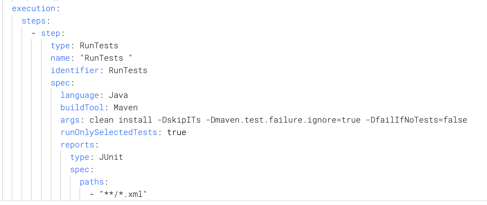

# Build and Test RocketMQ on Harness CI

This is a fork of RocketMQ project. This project was used to demo the new capabilities of Harness CI at [Unscripted Conference 2022](https://www.unscriptedconf.io/). This file contains instructions on how to run the RocketMQ pipeline shown during the demo.

- [Harness Fast CI Blog Announcement](https://harness.io/blog/announcing-speed-enhancements-and-hosted-builds-for-harness-ci)
- [Get Started with Harness CI](https://harness.io/products/continuous-integration)

## Setting up this pipeline on Harness CI Hosted Builds

1. Create a [GitHub Account](https://github.com) or use an existing one

2. Fork [this repository](https://github.com/apache/rocketmq) into your GitHub account.

3. If you are new to Harness CI, signup for [Harness CI](https://app.harness.io/auth/#/signup)
* Select the `Continuous Integration` module and choose the `Starter pipeline` wizard to create your first pipeline using the forked repo from #2.
* Go to the newly created pipeline and hit the `Triggers`tab. If everything went well, you should see two triggers auto-created. A `Pull Request`trigger and a `Push`trigger. For this exercise, we only need `Pull Request`trigger to be enabled. So, please disable or delete the `Push`trigger.

4. If you are an existing Harness CI user, create a new pipeline to use the cloud option for infrastructure and setup the PR trigger.

5. Enable Test Intelligence:

* Edit the pipeline yaml in the yaml editor to add this new step:
```
- step:
      type: RunTests
      name: "RunTests with Intelligence"
      identifier: RunTests with Intelligence
      spec:
        language: Java
        buildTool: Maven
        args: mvn clean install -DskipITs -Dmaven.test.failure.ignore=true -DfailIfNoTests=false
        runOnlySelectedTests: true
        reports:
          type: JUnit
          spec:
            paths:
              - "**/*.xml"
```
* The generated yaml should look like below.
  

6. Create a Pull Request in a new branch by updating the `build.gradle`file. (e.g. add a comment or new line). This should trigger a build in Harness CI

7. Merge the PR after the pipeline runs successfully.

8. Enable GitHub Actions : The repository forked in Step 2 already has a `GitHub Actions` workflow file added. You can choose to enable this workflow from the `Actions` tab on GitHub.

9. Create any other `Pull Request` with a few source or test file changes. You can consider cherry-picking any of the commits from the `RocketMQ` repo such as [this one](https://github.com/Aishwarya-Lad/rocketmq/pull/4)

10. This PR will trigger the Harness CI pipeline (as well as GitHub Actions workflow if enabled in Step-8). Depending on what files got changed in the PR, only those tests related to the changed source/test code will be selected to run in the Harness pipeline. GitHub Actions workflow, however, will run all the unit tests for every PR.