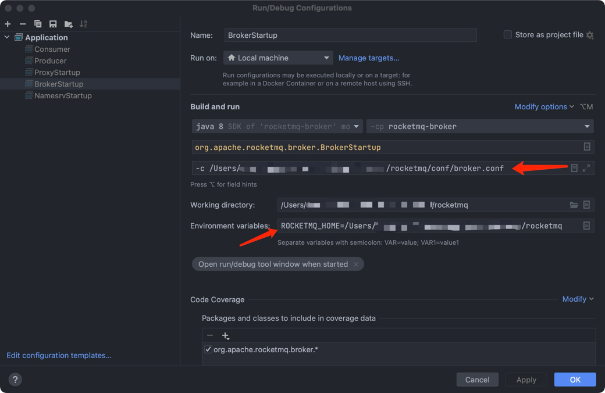

## 本地调试RocketMQ

### Step0: 解决依赖问题
1. 运行前下载RocketMQ需要的maven依赖，可以使用`mvn clean install -Dmaven.test.skip=true`
2. 确保本地能够编译通过

### Step1: 启动NameServer
1. NamerServer的启动类在`org.apache.rocketmq.namesrv.NamesrvStartup`
2. `Idea-Edit Configurations`中添加运行参数 `ROCKETMQ_HOME=<rocketmq仓库目录>`

3. 运行NameServer，观察到如下日志输出则启动成功
```shell
The Name Server boot success. serializeType=JSON, address 0.0.0.0:9876
```

### Step2: 启动Broker
1. Broker的启动类在`org.apache.rocketmq.broker.BrokerStartup`
2. 创建`/rocketmq/conf/broker.conf`文件或直接在官方release发布包中拷贝即可
```shell
# broker.conf

brokerClusterName = DefaultCluster
brokerName = broker-a
brokerId = 0
deleteWhen = 04
fileReservedTime = 48
brokerRole = ASYNC_MASTER
flushDiskType = ASYNC_FLUSH
namesrvAddr = 127.0.0.1:9876 # name server地址
```
3. `Idea-Edit Configurations`中添加运行参数 `ROCKETMQ_HOME=<rocketmq仓库目录>` 以及环境变量`-c /Users/xxx/rocketmq/conf/broker.conf`

4. 运行Broker，观察到如下日志则启动成功
```shell
The broker[broker-a,192.169.1.2:10911] boot success...
```

### Step3: 发送或消费消息
至此已经完成了RocketMQ的启动，可以使用`/example`里的示例进行收发消息

### 补充：本地启动Proxy
1. RocketMQ5.x支持了Proxy模式，使用`LOCAL`模式可以免去`Step2`，启动类在`org.apache.rocketmq.proxy.ProxyStartup`
2. `Idea-Edit Configurations`中添加运行参数 `ROCKETMQ_HOME=<rocketmq仓库目录>`
3. 在`/conf/`下新建配置文件`rmq-proxy.json`
```json
{
  "rocketMQClusterName": "DefaultCluster",
  "nameSrvAddr": "127.0.0.1:9876",
  "proxyMode": "local"
}
```
4. 运行Proxy，观察到如下日志则启动成功
```shell
Sat Aug 26 15:29:33 CST 2023 rocketmq-proxy startup successfully
```