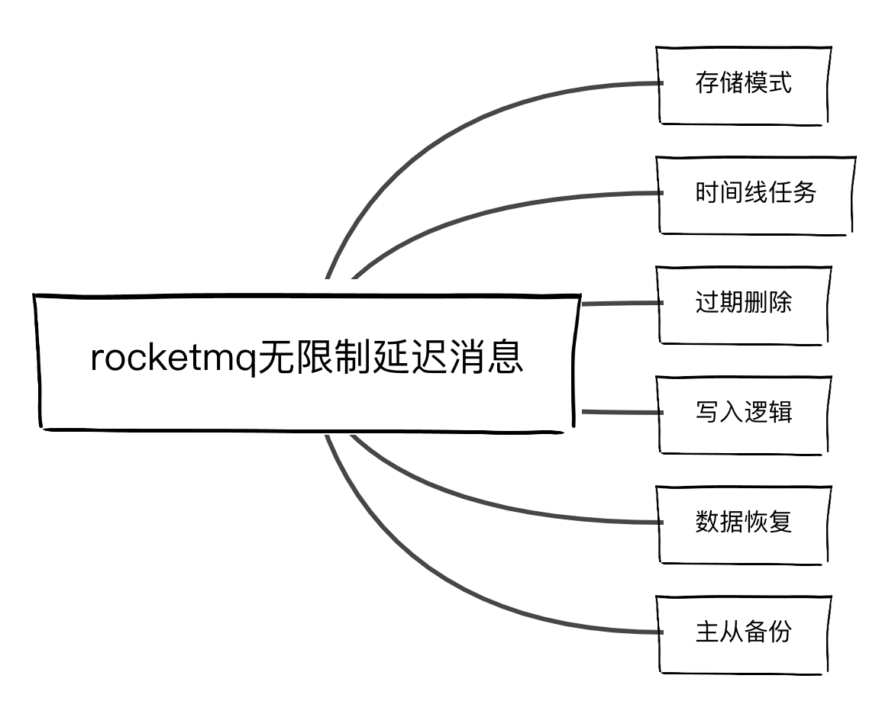
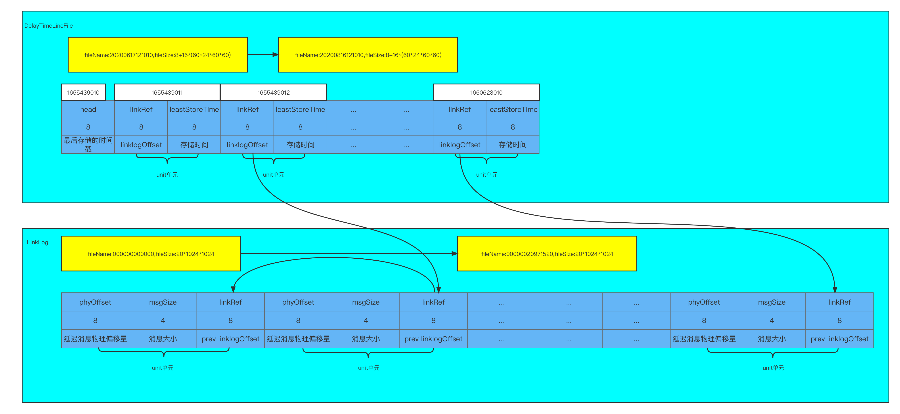
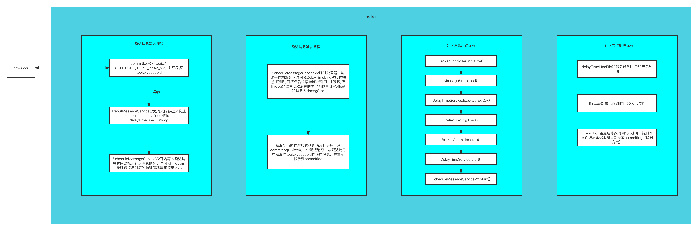

## 构思
以秒级延迟消息为单位构建一个时间顺序的文件delayTimeLine，不同的延迟消息映射到文件的对应时间单元上，存在相同延迟时间的消息则被加入到delaylinklog日志中顺序写，异步时间线程按当前时间秒去查找当前秒过期的延迟消息，读取并还原成原消息重新投放入commitlog

## 设计
涉及内容：


存储结构设计：

流程：


## 问题
- 秒级触发器如果当前秒任务太多执行时间超过1秒，会影响下一秒任务（可以考虑对查到后的延迟消息做异步派发重新投放入commitlog）
- commitlog的文件删除时间，因为延迟消息也存放在commitlog，commitlog默认是3天没有修改会过期删除，要保证2个月内的演出消息不丢失是一个问题

针对于第二个问题，目前有三个方案

方案一：
    修改commitlog的过期时间为2个月，简单粗暴

方案二：
    在commitlog过期删除的时候，遍历待删除的文件的每一条消息，如果是延迟消息就重新投放入commitlog，但这样会加大linklog的引用链路，而且这个延迟消息可能已经消费了

方案三：
    在DefaultMessageStore消息存储模块重新写一个DelayCommitlog，根据是否是延迟消息路由选择写入commitlog还是DelayCommmitlog，这样负载度上升，而且也要考虑主从复制问题

## 测试
消费延迟消息
```java
// org.apache.rocketmq.example.delay.DelayTimeMessageConsumer

package org.apache.rocketmq.example.delay;

import org.apache.rocketmq.client.consumer.DefaultMQPushConsumer;
import org.apache.rocketmq.client.consumer.listener.ConsumeConcurrentlyStatus;
import org.apache.rocketmq.client.consumer.listener.MessageListenerConcurrently;
import org.apache.rocketmq.common.message.MessageExt;

public class DelayTimeMessageConsumer {

    public static final String CONSUMER_GROUP = "DelayExampleConsumer";
    public static final String DEFAULT_NAMESRVADDR = "127.0.0.1:9876";
    public static final String TOPIC = "TopicTest";

    public static void main(String[] args) throws Exception {
        // Instantiate message consumer
        DefaultMQPushConsumer consumer = new DefaultMQPushConsumer(CONSUMER_GROUP);

        // Uncomment the following line while debugging, namesrvAddr should be set to your local address
        consumer.setNamesrvAddr(DEFAULT_NAMESRVADDR);

        // Subscribe topics
        consumer.subscribe(TOPIC, "*");
        // Register message listener
        consumer.registerMessageListener((MessageListenerConcurrently) (messages, context) -> {
            for (MessageExt message : messages) {
                // Print approximate delay time period
                System.out.printf("message[msgId=%s %d  ms later, content=%s]\n", message.getMsgId(),
                    System.currentTimeMillis() - message.getBornTimestamp(), new String(message.getBody()));
            }
            return ConsumeConcurrentlyStatus.CONSUME_SUCCESS;
        });
        // Launch consumer
        consumer.start();
        //info:to see the time effect, run the consumer first , it will wait for the msg
        //then start the producer
    }
}

```


生产延迟消息
```java
// org.apache.rocketmq.example.delay.DelayTimeMessageProducer


package org.apache.rocketmq.example.delay;

import org.apache.rocketmq.client.producer.DefaultMQProducer;
import org.apache.rocketmq.client.producer.SendResult;
import org.apache.rocketmq.common.UtilAll;
import org.apache.rocketmq.common.message.Message;

public class DelayTimeMessageProducer {

    public static final String PRODUCER_GROUP = "DelayExampleProducerGroup";
    public static final String DEFAULT_NAMESRVADDR = "127.0.0.1:9876";
    public static final String TOPIC = "TopicTest";

    public static void main(String[] args) throws Exception {
        // Instantiate a producer to send scheduled messages
        DefaultMQProducer producer = new DefaultMQProducer(PRODUCER_GROUP);

        // Uncomment the following line while debugging, namesrvAddr should be set to your local address
        producer.setNamesrvAddr(DEFAULT_NAMESRVADDR);

        // Launch producer
        producer.start();
        int totalMessagesToSend = 10;
        for (int i = 0; i < totalMessagesToSend; i++) {
            final long currentTimeMillis = System.currentTimeMillis();
            Message message = new Message(TOPIC,
                ("Hello scheduled message " + i+" hour, start time "+currentTimeMillis +", "+ UtilAll.timeMillisToHumanString(currentTimeMillis)).getBytes());
            // This message will be delivered to consumer i hour later.
            message.setDelayTime(i*60*60*1000);
            // Send the message
            SendResult result = producer.send(message);
            System.out.print(result);
        }

        // Shutdown producer after use.
        producer.shutdown();
    }

}

```