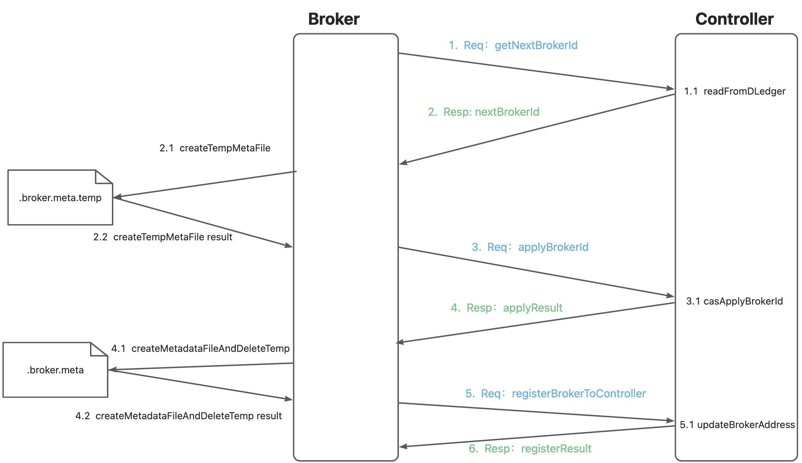
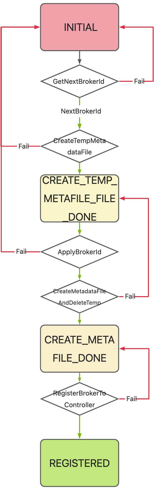
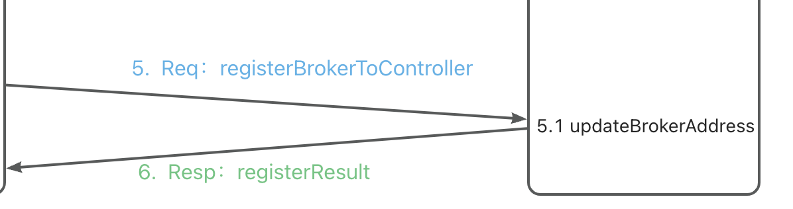
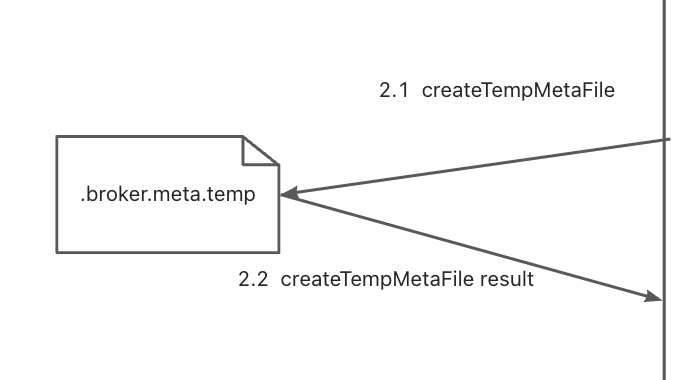
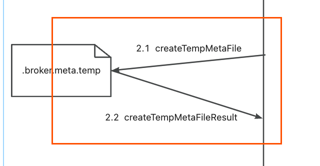

# 持久化的唯一BrokerId

## 现阶段问题

在 RocketMQ 5.0.0 和 5.1.0 版本中，采用`BrokerAddress`作为Broker在Controller模式下的唯一标识。导致如下情景出现问题：

- 在容器或者K8s环境下，每次Broker的重启或升级都可能会导致IP发生变化，导致之前的`BrokerAddress`留下的记录没办法和重启后的Broker联系起来，比如说`ReplicaInfo`, `SyncStateSet`等数据。

## 改进方案

在Controller侧采用`BrokerName:BrokerId`作为唯一标识，不再以`BrokerAddress`作为唯一标识。并且需要对`BrokerId`进行持久化存储，由于`ClusterName`和`BrokerName`都是启动的时候在配置文件中配置好的，所以只需要处理`BrokerId`的分配和持久化问题。
Broker第一次上线的时候，只有配置文件中配置的`ClusterName`和`BrokerName`，以及自身的`BrokerAddress`。那么我们需要和`Controller`协商出一个在整个集群生命周期中都唯一确定的标识：`BrokerId`，该`BrokerId`从1开始分配。当某一个Broker被选为Master的时候，在向Name Server中重新注册时，将更改为`BrokerId`为0 (兼容之前逻辑 brokerId为0代表着Broker是Master身份)。

### 上线流程

#### 1. GetNextBrokerId Request

这时候发起一个`GetNextBrokerId`的请求到Controller，为了拿到当前的下一个待分配的`BrokerId`(从1开始分配)。

#### 1.1 ReadFromDLedger

此时Controller接收到请求，然后走DLedger去获取到状态机的`NextBrokerId`数据。

#### 2. GetNextBrokerId Response

Controller将`NextBrokerId`返回给Broker。

#### 2.1 CreateTempMetaFile

Broker拿到`NextBrokerId`之后，创建一个临时文件`.broker.meta.temp`，里面记录了`NextBrokerId`(也就是期望应用的`BrokerId`)，以及自己生成一个`RegisterCode`(用于之后的身份校验)也持久化到临时文件中。

#### 3. ApplyBrokerId Request

Broker携带着当前自己的基本数据(`ClusterName`、`BrokerName`和`BrokerAddress`)以及此时期望应用的`BrokerId`和`RegisterCode`，发送一个`ApplyBrokerId`的请求到Controller。

#### 3.1 CASApplyBrokerId

Controller通过DLedger写入该事件，当该事件(日志)被应用到状态机的时候，判断此时是否可以应用该`BrokerId`(若`BrokerId`已被分配并且也不是分配给该Broker时则失败)。并且此时会记录下来该`BrokerId`和`RegisterCode`之间的关系。

#### 4. ApplyBrokerId Response

若上一步成功应用了该`BrokerId`，此时则返回成功给Broker，若失败则返回当前的`NextBrokerId`。

#### 4.1 CreateMetaFileFromTemp

若上一步成功的应用了该`BrokerId`，那么此时可以视为Broker侧成功的分配了该BrokerId，那么此时我们也需要彻底将这个BrokerId的信息持久化，那么我们就可以直接原子删除`.broker.meta.temp`并创建`.broker.meta`。删除和创建这两步需为原子操作。

> 经过上述流程，第一次上线的broker和controller成功协商出一个双方都认同的brokeId并持久化保存起来。

#### 5. RegisterBrokerToController Request

之前的步骤已经正确协商出了`BrokerId`，但是这时候有可能Controller侧保存的`BrokerAddress`是上次Broker上线的时候的`BrokerAddress`，所以现在需要更新一下`BrokerAddress`，发送一个`RegisterBrokerToController` 请求并带上当前的`BrokerAddress`。

#### 5.1 UpdateBrokerAddress

Controller比对当前该Broker在Controller状态机中保存的`BrokerAddress`，若和请求中携带的不一致则更新为请求中的`BrokerAddress`。

#### 6. RegisterBrokerToController Response

Controller侧在更新完`BrokerAddress`之后可携带着当前该Broker所在的`Broker-set`的主从信息返回，用于通知Broker进行相应的身份转变。

### 注册状态轮转

### 故障容错

> 如果在正常上线流程中出现了各种情况的宕机，则以下流程保证正确的`BrokerId`分配

#### 正常重启后的节点上线

若是正常重启，那么则已经在双方协商出唯一的`BrokerId`，并且本地也在`broker.meta`中有该`BrokerId`的数据，那么就该注册流程不需要进行，直接继续后面的流程即可。即从`RegisterBrokerToController`处继续上线即可。

#### CreateTempMetaFile失败

如果是上图中的流程失败的话，那么Broker重启后，Controller侧的状态机本身也没有分配任何`BrokerId`。Broker自身也没有任何数据被保存。因此直接重新按照上述流程从头开始走即可。

#### CreateTempMetaFile成功，ApplyBrokerId未成功

若是Controller侧已经认为本次`ApplyBrokerId`请求不对(请求去分配一个已被分配的`BrokerId`并且该 `RegisterCode`不相等)，并且此时返回当前的`NextBrokerId`给Broker，那么此时Broker直接删除`.broker.meta.temp`文件，接下来回到第2步，重新开始该流程以及后续流程。

#### ApplyBrokerId成功，CreateMetaFileFromTemp未成功

上述情况可以出现在`ApplyResult`丢失、CAS删除并创建`broker.meta`失败，这俩流程中。
那么重启后，Controller侧是已经认为我们`ApplyBrokerId`流程是成功的了，而且也已经在状态机中修改了BrokerId的分配数据，那么我们这时候重新直接开始步骤3，也就是发送`ApplyBrokerId`请求的这一步。

因为我们有`.broker.meta.temp`文件，可以从中拿到我们之前成功在Controller侧应用的`BrokerId`和`RegisterCode`，那么直接发送给Controller，如果Controller中存在该`BrokerId`并且`RegisterCode`和请求中的`RegisterCode`相等，那么视为成功。

### 正确上线后使用BrokerId作为唯一标识

当正确上线之后，之后Broker的请求和状态记录都以`BrokerId`作为唯一标识。心跳等数据的记录都以`BrokerId`为标识。
同时Controller侧也会记录当前该`BrokerId`的`BrokerAddress`，在主从切换等时候用于通知Broker状态变化。

> 默认持久化ID的文件在~/store/brokerIdentity，也可以设置storePathBrokerIdentity参数来决定存储路径。在自动主备切换模式下，不要随意删除该文件，否则该 Broker 会被当作新 Broker 上线。

## 升级方案

4.x 版本升级遵守 5.0 升级文档流程即可。
5.0.0 和 5.1.0 非持久化BrokerId版本升级到 5.1.1 及以上持久化BrokerId版本按照如下流程:

### 升级Controller

1. 将旧版本Controller组停机。
2. 清除Controller数据，即默认在`~/DLedgerController`下的数据文件。
3. 上线新版Controller组。

> 在上述升级Controller流程中，Broker仍可正常运行，但无法切换。

### 升级Broker

1. 将Broker从节点停机。
2. 将Broker主节点停机。
3. 将所有的Broker的Epoch文件删除，即默认为`~/store/epochFileCheckpoint`和`~/store/epochFileCheckpoint.bak`。
4. 将原先的主Broker先上线，等待该Broker当选为master。(可使用`admin`命令的`getSyncStateSet`来观察)
5. 将原来的从Broker全部上线。

> 建议停机时先停从再停主，上线时先上原先的主再上原先的从，这样可以保证原来的主备关系。
若需要改变升级前后主备关系，则需要停机时保证主、备的CommitLog对齐，否则可能导致数据被截断而丢失。

### 兼容性

|                    | 5.1.0 及以下版本 Controller | 5.1.1 及以上版本 Controller             |
|--------------------|------------------------|------------------------------------|
| 5.1.0 及以下版本 Broker | 正常运行，可切换               | 若已主备确定则可正常运行，不可切换。若broker重新启动则无法上线 |
| 5.1.1 及以上版本 Broker | 无法正常上线                 | 正常运行，可切换                           |
