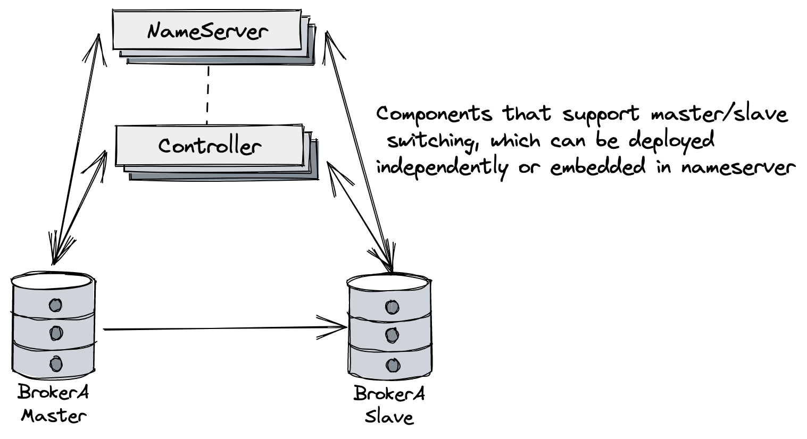
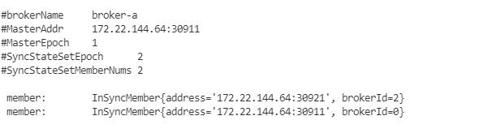
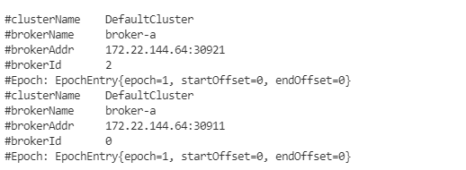
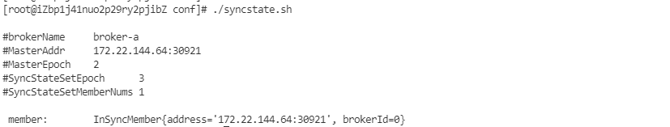

# 自动主从切换快速开始

## 前言



该文档主要介绍如何快速构建自动主从切换的 RocketMQ 集群，其架构如上图所示，主要增加支持自动主从切换的Controller组件，其可以独立部署也可以内嵌在NameServer中。

详细设计思路请参考 [设计思想](design.md).

详细的新集群部署和旧集群升级指南请参考 [部署指南](deploy.md)。

## 编译 RocketMQ 源码

```shell
$ git clone https://github.com/apache/rocketmq.git

$ cd rocketmq

$ mvn -Prelease-all -DskipTests clean install -U
```

## 快速部署

在构建成功后

```shell
#{rocketmq-version} replace with rocketmq actual version. example: 5.0.0-SNAPSHOT
$ cd distribution/target/rocketmq-{rocketmq-version}/rocketmq-{rocketmq-version}/

$ sh bin/controller/fast-try.sh start
```

如果上面的步骤执行成功，可以通过运维命令查看Controller状态。

```shell
$ sh bin/mqadmin getControllerMetaData -a localhost:9878
```

-a代表集群中任意一个Controller的地址

至此，启动成功，现在可以向集群收发消息，并进行切换测试了。

如果需要关闭快速集群，可以执行：

```shell
$ sh bin/controller/fast-try.sh stop
```

对于快速部署，默认配置在 conf/controller/quick-start里面，默认的存储路径在 /tmp/rmqstore，且会开启一个 Controller (嵌入在 Namesrv) 和两个 Broker。

### 查看 SyncStateSet

可以通过运维工具查看 SyncStateSet：

```shell
$ sh bin/mqadmin getSyncStateSet -a localhost:9878 -b broker-a
```

-a 代表的是任意一个 Controller 的地址

如果顺利的话，可以看到以下内容：



### 查看 BrokerEpoch

可以通过运维工具查看 BrokerEpochEntry：

```shell
$ sh bin/mqadmin getBrokerEpoch -n localhost:9876 -b broker-a
```

-n 代表的是任意一个 Namesrv 的地址

如果顺利的话，可以看到以下内容：



## 切换

部署成功后，现在尝试进行 Master 切换。

首先，kill 掉原 Master 的进程，在上文的例子中，就是使用端口 30911 的进程：

```shell
#查找端口:
$ ps -ef|grep java|grep BrokerStartup|grep ./conf/controller/quick-start/broker-n0.conf|grep -v grep|awk '{print $2}'
#杀掉 master:
$ kill -9 PID
```

接着，用 SyncStateSet admin 脚本查看：

```shell
$ sh bin/mqadmin getSyncStateSet -a localhost:9878 -b broker-a
```

可以发现 Master 已经发生了切换。




## Controller内嵌Namesvr集群部署

Controller以插件方式内嵌Namesvr集群(3个Node组成)部署，快速启动：

```shell
$ sh bin/controller/fast-try-namesrv-plugin.sh start
```

或者通过命令单独启动：

```shell
$ nohup bin/mqnamesrv -c ./conf/controller/cluster-3n-namesrv-plugin/namesrv-n0.conf &
$ nohup bin/mqnamesrv -c ./conf/controller/cluster-3n-namesrv-plugin/namesrv-n1.conf &
$ nohup bin/mqnamesrv -c ./conf/controller/cluster-3n-namesrv-plugin/namesrv-n2.conf &
```

如果上面的步骤执行成功，可以通过运维命令查看Controller集群状态。

```shell
$ sh bin/mqadmin getControllerMetaData -a localhost:9878
```

-a代表的是任意一个 Controller 的地址

如果controller启动成功可以看到以下内容：

```
#ControllerGroup        group1
#ControllerLeaderId     n0
#ControllerLeaderAddress        127.0.0.1:9878
#Peer:  n0:127.0.0.1:9878
#Peer:  n1:127.0.0.1:9868
#Peer:  n2:127.0.0.1:9858
```

启动成功后Broker Controller模式部署就能使用Controller集群。

如果需要快速停止集群：

```shell
$ sh bin/controller/fast-try-namesrv-plugin.sh stop
```

使用 fast-try-namesrv-plugin.sh 脚本快速部署，默认配置在 conf/controller/cluster-3n-namesrv-plugin里面并且会启动3个Namesvr和3个Controller(内嵌Namesrv)。

## Controller独立集群部署

Controller独立集群(3个Node组成)部署，快速启动：

```shell
$ sh bin/controller/fast-try-independent-deployment.sh start
```

或者通过命令单独启动：

```shell
$ nohup bin/mqnamesrv -c ./conf/controller/cluster-3n-independent/controller-n0.conf &
$ nohup bin/mqnamesrv -c ./conf/controller/cluster-3n-independent/controller-n1.conf &
$ nohup bin/mqnamesrv -c ./conf/controller/cluster-3n-independent/controller-n2.conf &
```

如果上面的步骤执行成功，可以通过运维命令查看Controller集群状态。

```shell
$ sh bin/mqadmin getControllerMetaData -a localhost:9878
```

-a代表的是任意一个 Controller 的地址

如果Controller启动成功可以看到以下内容：

```
#ControllerGroup        group1
#ControllerLeaderId     n1
#ControllerLeaderAddress        127.0.0.1:9868
#Peer:  n0:127.0.0.1:9878
#Peer:  n1:127.0.0.1:9868
#Peer:  n2:127.0.0.1:9858
```

启动成功后Broker Controller模式部署就能使用Controller集群。

如果需要快速停止集群：

```shell
$ sh bin/controller/fast-try-independent-deployment.sh stop
```

使用fast-try-independent-deployment.sh 脚本快速部署，默认配置在 conf/controller/cluster-3n-independent里面并且会启动3个Controller(独立部署)组成一个集群。


## 注意说明

- 若需要保证Controller具备容错能力，Controller部署需要三副本及以上（遵循Raft的多数派协议）
- Controller部署配置文件中配置参数`controllerDLegerPeers` 中的IP地址配置成其他节点能够访问的IP,在多机器部署的时候尤为重要。例子仅供参考需要根据实际情况进行修改调整。
