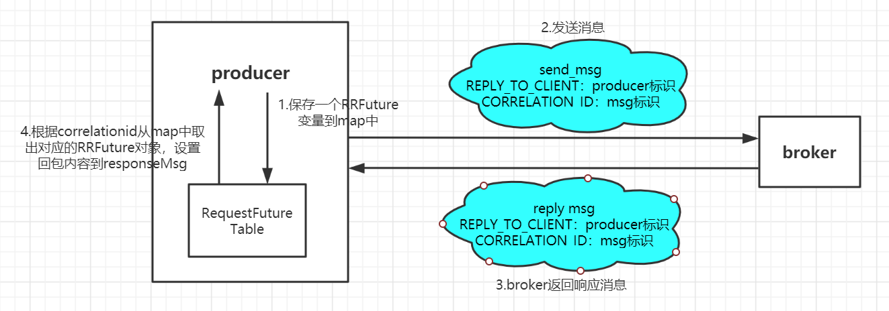

# “Request-Reply”特性
---

## 1 使用场景
随着服务规模的扩大，单机服务无法满足性能和容量的要求，此时需要将服务拆分为更小粒度的服务或者部署多个服务实例构成集群来提供服务。在分布式场景下，RPC是最常用的联机调用的方式。

在构建分布式应用时，有些领域，例如金融服务领域，常常使用消息队列来构建服务总线，实现联机调用的目的。消息队列的主要场景是解耦、削峰填谷，在联机调用的场景下，需要将服务的调用抽象成基于消息的交互，并增强同步调用的这种交互逻辑。为了更好地支持消息队列在联机调用场景下的应用，rocketmq-4.7.0推出了“Request-Reply”特性来支持RPC调用。

## 2 设计思路
在rocketmq中，整个同步调用主要包括两个过程：

（1）请求方生成消息，发送给响应方，并等待响应方回包；

（2）响应方收到请求消息后，消费这条消息，并发出一条响应消息给请求方。

整个过程实质上是两个消息收发过程的组合。所以这里最关键的问题是如何将异步的消息收发过程构建成一个同步的过程。其中主要有两个问题需要解决：

### 2.1 请求方如何同步等待回包

这个问题的解决方案中，一个关键的数据结构是RequestResponseFuture。

```
public class RequestResponseFuture {
    private final String correlationId;
    private final RequestCallback requestCallback;
    private final long beginTimestamp = System.currentTimeMillis();
    private final Message requestMsg = null;
    private long timeoutMillis;
    private CountDownLatch countDownLatch = new CountDownLatch(1);
    private volatile Message responseMsg = null;
    private volatile boolean sendRequestOk = true;
    private volatile Throwable cause = null;
}
```
RequestResponseFuture中，利用correlationId来标识一个请求。如下图所示，Producer发送request时创建一个RequestResponseFuture，以correlationId为key，RequestResponseFuture为value存入map，同时请求中带上RequestResponseFuture中的correlationId，收到回包后根据correlationId拿到对应的RequestResponseFuture，并设置回包内容。


### 2.2 consumer消费消息后，如何准确回包

（1）producer在发送消息的时候，会给每条消息生成唯一的标识符，同时还带上了producer的clientId。当consumer收到并消费消息后，从消息中取出消息的标识符correlationId和producer的标识符clientId，放入响应消息，用来确定此响应消息是哪条请求消息的回包，以及此响应消息应该发给哪个producer。同时响应消息中设置了消息的类型以及响应消息的topic，然后consumer将消息发给broker，如下图所示。


（2）broker收到响应消息后，需要将消息发回给指定的producer。Broker如何知道发回给哪个producer？因为消息中包含了producer的标识符clientId，在ProducerManager中，维护了标识符和channel信息的对应关系，通过这个对应关系，就能把回包发给对应的producer。

响应消息发送和一般的消息发送流程区别在于，响应消息不需要producer拉取，而是由broker直接推给producer。同时选择broker的策略也有变化：请求消息从哪个broker发过来，响应消息也发到对应的broker上。

Producer收到响应消息后，根据消息中的唯一标识符，从RequestResponseFuture的map中找到对应的RequestResponseFuture结构，设置响应消息，同时计数器减一，解除等待状态，使请求方收到响应消息。

## 3 使用方法

同步调用的示例在example文件夹的rpc目录下。

### 3.1 Producer
```
Message msg = new Message(topic,
                "",
                "Hello world".getBytes(RemotingHelper.DEFAULT_CHARSET));

            long begin = System.currentTimeMillis();
            Message retMsg = producer.request(msg, ttl);
            long cost = System.currentTimeMillis() - begin;
            System.out.printf("request to <%s> cost: %d replyMessage: %s %n", topic, cost, retMsg);
```
调用接口替换为request即可。

### 3.2 Consumer
需要启动一个producer，同时在覆写consumeMessage方法的时候，自定义响应消息并发送。

```
            @Override
            public ConsumeConcurrentlyStatus consumeMessage(List<MessageExt> msgs, ConsumeConcurrentlyContext context) {
                System.out.printf("%s Receive New Messages: %s %n", Thread.currentThread().getName(), msgs);
                for (MessageExt msg : msgs) {
                    try {
                        System.out.printf("handle message: %s", msg.toString());
                        String replyTo = MessageUtil.getReplyToClient(msg);
                        byte[] replyContent = "reply message contents.".getBytes();
                        // create reply message with given util, do not create reply message by yourself
                        Message replyMessage = MessageUtil.createReplyMessage(msg, replyContent);

                        // send reply message with producer
                        SendResult replyResult = replyProducer.send(replyMessage, 3000);
                        System.out.printf("reply to %s , %s %n", replyTo, replyResult.toString());
                    } catch (MQClientException | RemotingException | MQBrokerException | InterruptedException e) {
                        e.printStackTrace();
                    }
                }
                return ConsumeConcurrentlyStatus.CONSUME_SUCCESS;
            }
```

## 4 接口参数

4.1 public Message request(Message msg,long timeout)

msg：待发送的消息

timeout：同步调用超时时间

4.2 public void request(Message msg, final RequestCallback requestCallback, long timeout)

msg：待发送的消息

requestCallback：回调函数

timeout：同步调用超时时间

4.3 public Message request(final Message msg, final MessageQueueSelector selector, final Object arg,final long timeout)

msg：待发送的消息

selector：消息队列选择器

arg：消息队列选择器需要的参数

timeout：同步调用超时时间

4.4 public void request(final Message msg, final MessageQueueSelector selector, final Object arg,final RequestCallback requestCallback, final long timeout)

msg：待发送的消息

selector：消息队列选择器

arg：消息队列选择器需要的参数

requestCallback：回调函数

timeout：同步调用超时时间

4.5	public Message request(final Message msg, final MessageQueue mq, final long timeout)

msg：待发送的消息

mq：目标消息队列

timeout：同步调用超时时间

4.6	public void request(final Message msg, final MessageQueue mq, final RequestCallback requestCallback, long timeout)

msg：待发送的消息

mq：目标消息队列

requestCallback：回调函数

timeout：同步调用超时时间
