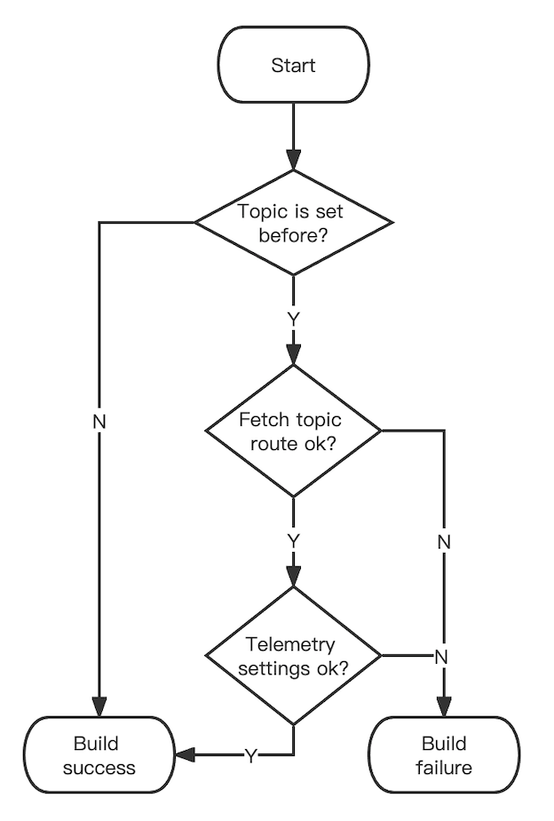

# RocketMQ 轻量级客户端

RocketMQ 轻量级客户端是基于 rocketmq-apis 模块的轻量级实现，为了达成这以目标，我们使用了 gRPC 替代了原有的 remoting 通信协议，大幅度简化了编码逻辑。与此同时，大面积地采用 pop 消费模式，解决了
remoting 客户端带来的负载均衡问题。

在轻量化之外，相对于旧有实现，进行了诸多改进。

## 错误前置

在大范围应用 builder 模式的前提下，进行了大量的静态检查，将诸多旧版本中可能在真正执行发送/消费动作时才发生的错误进行了前置。

一个典型的示例：路由类的错误即可以在正式消息发送流程之前得以发现。客户端一个通用的构建过程如下：

<div align="center">

</div>

对于 consumer 而言，在进行构建时已经包含了所需订阅的 topic，对于 producer 而言，我们也鼓励在构建时绑定需要发送的 topic，在此前提下，路由类的错误就可以在正式的消息发送/消费流程开始之前被捕捉。

## 配置收敛

同时，为了更好地进行服务治理。将更多的配置收敛到了服务端，客户端在执行远程调用之前，先会通过 Telemetry 通道获取对应的配置。

## 异步编程

RocketMQ 客户端往往要给用户同时提供同步和异步接口，在 5.x 之前的实现中，自下而上维护了两套逻辑。为了统一底层实现，降低维护成本，同时得益于 gRPC 完善的异步化实现，轻量级客户端从底层即采用 Guava Future
异步实现，直到面向客户的接口时才进行实现的分叉，保证了逻辑的统一性，同时异步操作形成 Future chain，编程时能保持与同步类似的步骤。

示例：消息内部发送的异步化接口：

```java
    /**
 * Send message asynchronously.
 *
 * @param metadata gRPC request header metadata.
 * @param request  send message request.
 * @param executor gRPC asynchronous executor.
 * @param duration request max duration.
 * @return response future of sending message.
 */
ListenableFuture<SendMessageResponse> sendMessage(Metadata metadata, SendMessageRequest request, Executor executor,
    Duration duration);
```


