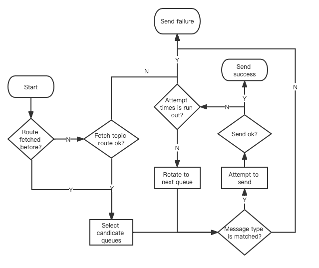
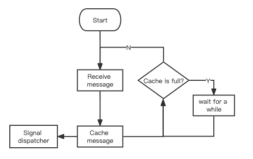
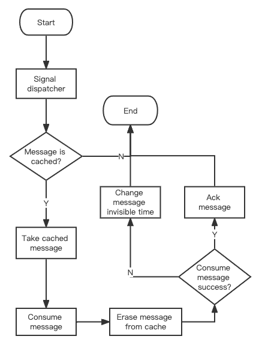
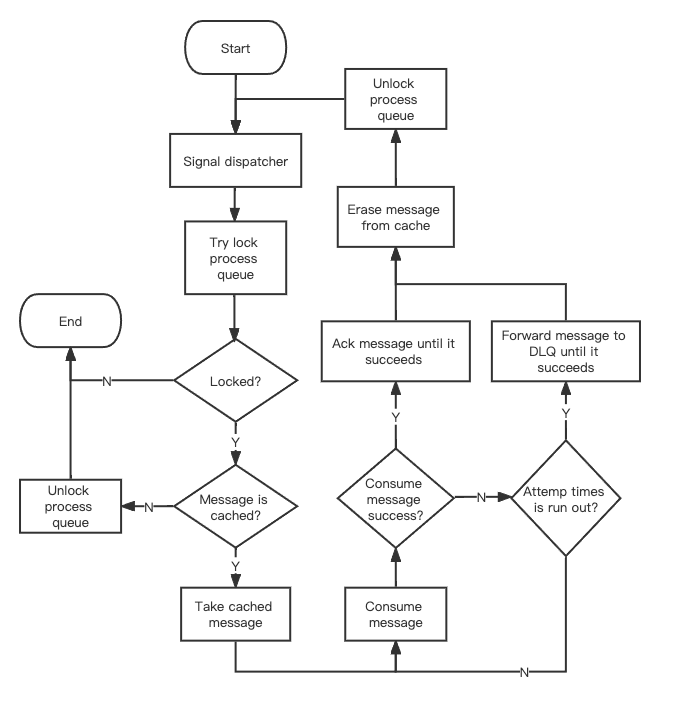

# 轻量级客户端的消息收发流程

## Producer

进行单条消息发送的业务流程：

1. 检查 topic 路由是否已经被获取；
2. 如果路由已经提前获取成功，则从中选择一批备选的队列准备进行发送，进入第 4 步，否则进入下一步；
3. 获取对应 topic 的路由，如果获取失败，则返回消息发送失败，否则进入下一步；
4. 从备选队列中选取一个队列准备发送；
5. 检查队列是否接受当前类型的消息，如果不接受，则返回消息发送失败，否则进入下一步；
6. 针对该队列发起消息发送，如果发送成功则返回消息发送成功，否则进入下一步；
7. 检查当前重试次数是否已经超出最大重试次数，如果超出，返回消息发送失败，否则从备选队列中轮转到下一个队列，重试次数加 1，进行第 5 步；

特别地：

* 对于事务型消息的发送，有且仅有一次机会进行发送，即不会进行内部重试。
* 一般而言，消息发送的内部重试是即时的。特别的，如果服务端返回的报错是请求被流控，那么客户端消息发送的重试策略则会遵循一定的退避间隔，该退避间隔由服务端决定。

## Push consumer

针对于消息的消费过程，按照消费模式的不同，会有不同的处理方式，消费模式由具体的 consumer group 元数据决定，分为普通消费模式和顺序消费模式，两者的不同在于：同队列的消息消费模式是否与发送保持相同的顺序。
顺序消费模式的保序具体来说，针对于发送者往相同队列发送成功的前后两条消息 A 和 B 而言，当且仅当消息 A 被消费者消费结束且服务端成功接收到具体消费结果的反馈之后才能开始消息 B 的消费。

与 producer 类似，consumer 中消息接受的基本单位也是队列，在客户端的具体实现过程中，队列与 process queue 这个结构是一一对应的，客户端接收到消息到时将其缓存到 process queue，进行消费时候则尝试从
process queue 中获取消息。下文中针对于消息的接收与消费过程都按照 message queue/process queue 为最小粒度进行展开。

另外当客户端接受到消息之后，需要通知下游进行消费，这个过程由 dispatcher 这个组件负责。

在客户端视角，消息从服务端到客户端被消费整个过程中大体可以被分为两个过程：

* 消息的接收与缓存流程：客户端接受消息并缓存到本地；
* 消息的消费流程：通知内部的 dispatcher 消费被缓存的消息；

消息的接收与缓存的流程大体如下：

1. 客户端主动向服务端发起接收消息的请求并成功接受到消息；
2. 通知 dispatcher 进行消息的消费；
3. 检查客户端本地缓存的消息是否超出限制，没有超出则重复第一步，否则等待一段时间然后重复执行本步骤；

### 普通消费模式

整个流程由消费者接受到消息且缓存成功进行驱动。

1. 接受到消息并缓存后，通知 dispatcher ；
2. 接到通知的 dispatcher 尝试从本地缓存中获取消息，如果本地缓存中没有消息，则终止当前流程，否则重复当前步骤；
3. 消费上一步取出的消息，然后将其从本地缓存中擦除；
4. 获取消费结果，如果消息消费成功，则执行 acknowledgement，否则执行 change invisible time 修改当前消息的可见时间；

### 顺序消费模式

整个流程由消费者接受到消息且缓存成功进行驱动，特别地，出于保序的前提，该模式下会涉及到锁定与解锁 process queue 的过程。

1. 接受到消息并缓存后，给 dispatcher 发送通知信号；
2. 接到通知的 dispatcher 对 process queue 进行锁定，如果锁定失败，则终止当前流程，否则尝试从本地缓存中获取队列中最早的一条消息；
3. 如果本地缓存中没有消息，则对 process queue 进行解锁，并终止当前流程；否则取出一条消息；
4. 消费当前消息；
5. 获取消息消费结果，如果消息消费成功，则进行第 6 步，否则进行第 7 步；
6. 对消息执行 acknowledgement，如果执行失败则重复本步骤直到执行成功；
7. 查看当前消息的消费次数，如果次数超过了最大消费次数，则执行 第 8 步，否则执行第 4 步：
8. 将消息投递进入死信队列，如果投递失败则重复本步骤直到执行成功；
9. 解锁 process queue 并给 dispatcher 发送通知信号，表示可以进行下一条消息的消费。

## Simple consumer

simple consumer 直接暴露了 receive/acknowledgement/change invisible time 等原子类接口，用户可以主动掌控消息接口的全生命周期。

一个典型的处理流程如下：

* 并发调用 receive 接口，从服务端获取消息；
* 获取到消息之后，执行相应的本地处理逻辑；
* 根据本地处理逻辑结果的不同，各自选择 acknowledgement/change invisible time 两种不同的处理方式。

所有暴露给客户的接口都只是远程过程调用的简单封装，不做任何内部重试。