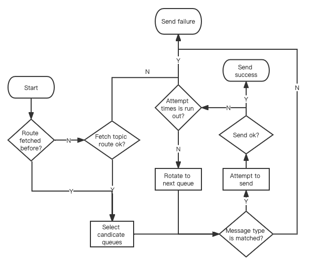

# RocketMQ 轻量级客户端 - Push consumer

producer 进行单条消息发送的业务流程如下：

1. 检查 topic 路由是否已经被获取；
2. 如果路由已经提前获取成功，则从中选择一批备选的队列准备进行发送，进入第 4 步，否则进入下一步；
3. 获取对应 topic 的路由，如果获取失败，则返回消息发送失败，否则进入下一步；
4. 从备选队列中选取一个队列准备发送；
5. 针对该队列发起消息发送，如果发送成功则返回消息发送成功，否则进入下一步；
6. 检查当前重试次数是否已经超出最大重试次数，如果超出，返回消息发送失败，否则从备选队列中轮转到下一个队列，重试次数加 1，进行第 4 步；

特别地：

* 对于事务型消息的发送，有且仅有一次机会进行发送，即不会进行内部重试。
* 一般而言，消息发送的内部重试是即时的，特别的，如果服务端返回的报错是请求被流控，那么客户端消息发送的重试策略则会遵循一定的退避间隔，该退避间隔由服务端决定。