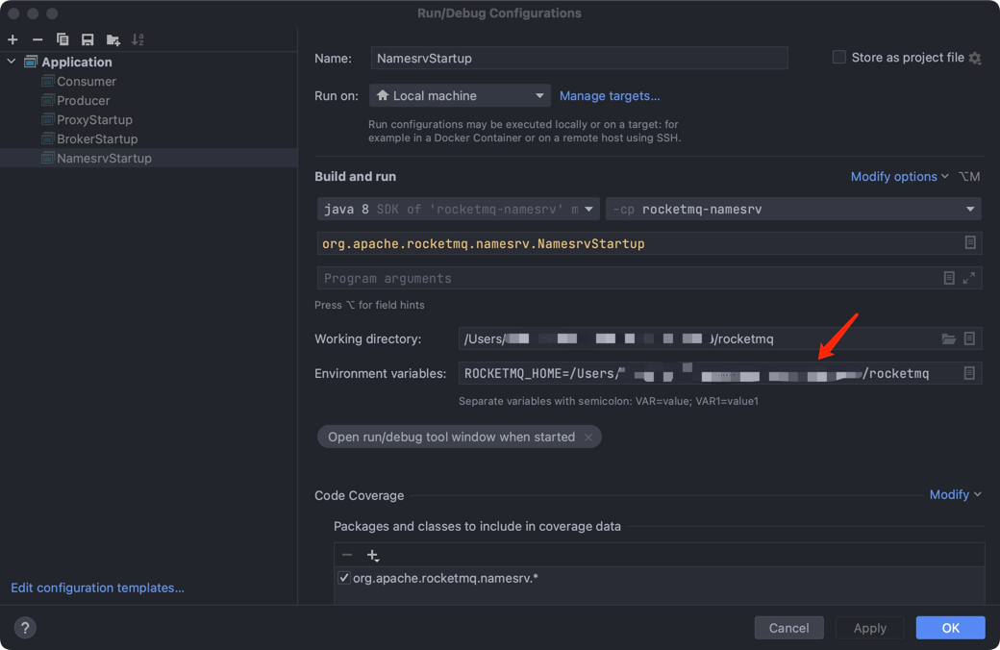
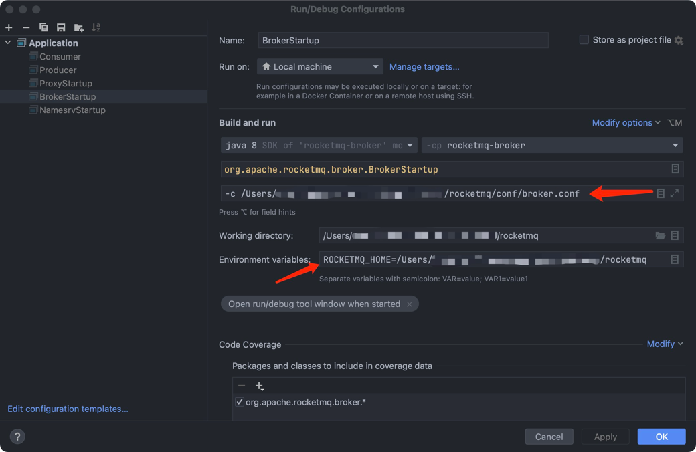

## How to Debug RocketMQ in Idea

### Step0: Resolve dependencies
1. To download the Maven dependencies required for running RocketMQ, you can use the following command:`mvn clean install -Dmaven.test.skip=true`
2. Ensure successful local compilation.

### Step1: Start NameServer
1. The startup class for NameServer is located in `org.apache.rocketmq.namesrv.NamesrvStartup`.
2. Add runtime `ROCKETMQ_HOME=<rocketmq repository directory>` parameters in `Idea-Edit Configurations`.

3. Run NameServer and if the following log output is observed, it indicates successful startup.
```shell
The Name Server boot success. serializeType=JSON, address 0.0.0.0:9876
```

### Step2: Start Broker
1. The startup class for Broker is located in`org.apache.rocketmq.broker.BrokerStartup`
2. Create the `/rocketmq/conf/broker.conf` file or simply copy it from the official release package.
```shell
# broker.conf

brokerClusterName = DefaultCluster
brokerName = broker-a
brokerId = 0
deleteWhen = 04
fileReservedTime = 48
brokerRole = ASYNC_MASTER
flushDiskType = ASYNC_FLUSH
namesrvAddr = 127.0.0.1:9876 # name server地址
```
3. Add the runtime parameter `ROCKETMQ_HOME=<rocketmq repository directory>` and the environment variable `-c /Users/xxx/rocketmq/conf/broker.conf` in `Idea-Edit Configurations`.

4. Run the Broker and if the following log is observed, it indicates successful startup.
```shell
The broker[broker-a,192.169.1.2:10911] boot success...
```

### Step3: Send or Consume Messages
RocketMQ startup is now complete. You can use the examples provided in `/example` to send and consume messages.

### Additional: Start the Proxy locally.
1. RocketMQ 5.x introduced the Proxy mode. Using the `LOCAL` mode eliminates the need for `Step2`. The startup class is located at `org.apache.rocketmq.proxy.ProxyStartup`.
2. Add the runtime parameter `ROCKETMQ_HOME=<rocketmq repository directory>` in `Idea-Edit Configurations`.
3. Create a new configuration file named `rmq-proxy.json` in the `/conf/` directory.
```json
{
  "rocketMQClusterName": "DefaultCluster",
  "nameSrvAddr": "127.0.0.1:9876",
  "proxyMode": "local"
}
```
4. Run the Proxy, and if the following log is observed, it indicates successful startup.
```shell
Sat Aug 26 15:29:33 CST 2023 rocketmq-proxy startup successfully
```