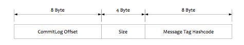

# Message Filter
RocketMQ - a distributed message queue, is different with all other MQ middleware, on the way of filtering messages. It's do the filter when the messages are subscribed via consumer side.RocketMQ do it lies in the separate storage mechanism that Producer side writing messages and Consomer subscribe messages, Consumer side will get an index from a logical message queue ConsumeQueue when subscribing, then read message entity from CommitLog using the index. So in the end, it is still impossible to get around its storage structure.The storage structure of ConsumeQueue is as follows, and there is a 8-byte Message Tag hashcode, The message filter based on Tag value is just used this Message Tag hash-code.

The RocketMQ has two mainly filter types:

* Tag filtering: Consumer can specify not only the message topic but also the message tag values, when subscribing. Multiple tag values need to be separated by '||'. When consumer subscribing a message, it builds the subscription request into a `SubscriptionData` object and sends a pull message request to the Broker side. Before the Broker side reads data from the RocketMQ file storage layer - Store, it will construct a `MessageFilter` using the `SubscriptionData` object and then pass it to the Store. Store get a record from `ConsumeQueue`, and it will filter the message by the saved tag hashcode, it is unable to filter the messages exactly in the server side because of only the hashcode will be used when filtering, Therefore, after the Consumer pulls the message, it also needs to compare the original tag string of the message. If the original tag string is not same with the expected, the message will be ignored.

* SQL92 filtering: This filter behavior is almost same with the above `Tag filtering` method. The only difference is on the way how Store works. The rocketmq-filter module is responsible for the construction and execution of the real SQL expression. Executing an SQL expression every time a filter is executed affects efficiency, so RocketMQ uses BloomFilter to avoid doing it every time. The expression context of SQL92 is a property of the message.
