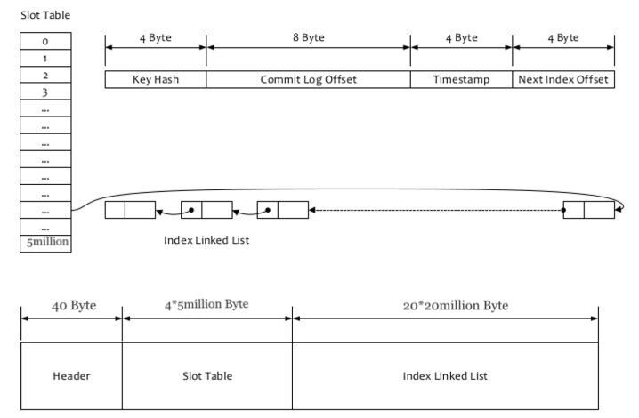

# Message Queries

RocketMQ supports message queries by two dimensions, which are "Query Message by Message Id" and "Query Message by Message Key".

## 1. Query Message by Message Id
The MessageId in RocketMQ has a total length of 16 bytes, including the broker address (IP address and port) and CommitLog offset. In RocketMQ, the specific approach is that the Client resolves the Broker's address (IP address and port) and the CommitLog's offset address from the MessageId. Then both of them are encapsulated into an RPC request, and finally it will be sent through the communication layer (business request code: VIEW_MESSAGE_BY_ID). The Broker reads a message by using the CommitLog offset and size to find the real message in the CommitLog and then return, which is how QueryMessageProcessor works.

## 2. Query Message by Message Key
"Query Messages by Message Key" is mainly based on RocketMQ's IndexFile. The logical structure of the IndexFile is similar to the implementation of HashMap in JDK. The specific structure of the IndexFile is as follows:

The IndexFile provides the user with the querying service by “Querying Messages by Message Key”. The IndexFile is stored in $HOME\store\index${fileName}, and the file name is named after the timestamp at the time of creation. The file size is fixed, which is 420,000,040 bytes (40+5million\*4+20million\*20). If the UNIQ_KEY is set in the properties of the message, then the "topic + ‘#’ + UNIQ_KEY" will be used as the index. Likewise, if the KEYS is set in the properties of the message (multiple KEYs should be separated by spaces), then the "topic + ‘#’ + KEY" will be used as the index.

The header of IndexFile contains eight fields, `beginTimestamp`(8 bytes), `endTimestamp`(8 bytes), `beginPhyOffset`(8 bytes), `endPhyOffset`(8 bytes), `hashSlotCount`(4 bytes), and `indexCount`(4 bytes).`beginTimestamp` and `endTimestamp` represents the storeTimestamp of the message corresponding to the first and last index, `beginPhyOffset` and `endPhyOffset` represent the physical offset of the message corresponding to the first and last index. `hashSlotCount` represents the count of hash slot. `indexCount` represents the count of indexes.

The index data contains four fields, `Key Hash`, `CommitLog offset`, `Timestamp` and `NextIndex offset`, for a total of 20 Bytes. The `NextIndex offset` of the index data will point to the previous index data if the `Key Hash` of the index data is the same as that of the previous index data. If a hash conflict occurs, then the `NextIndex offset` can be used as the field to string all conflicting indexes in a linked list. What the `Timestamp` records is the time difference between the `storeTimestamp` of the message associated with the current key and the `BeginTimestamp` in the `IndexHeader`, instead of a specific time. The structure of the entire IndexFile is shown in the graph. The Header is used to store some general statistics, which needs 40 bytes. The Slot Table of 4\*5million bytes does not save the real index data, but saves the header of the singly linked list corresponding to each slot. The Index Linked List of 20\*20million is the real index data, that is, an Index File can hold 20million indexes.

The specific method of "Query Message by Message Key" is that the topic and message key are used to find the record in the IndexFile, and then read the message from the file of CommitLog according to the CommitLog offset in this record.