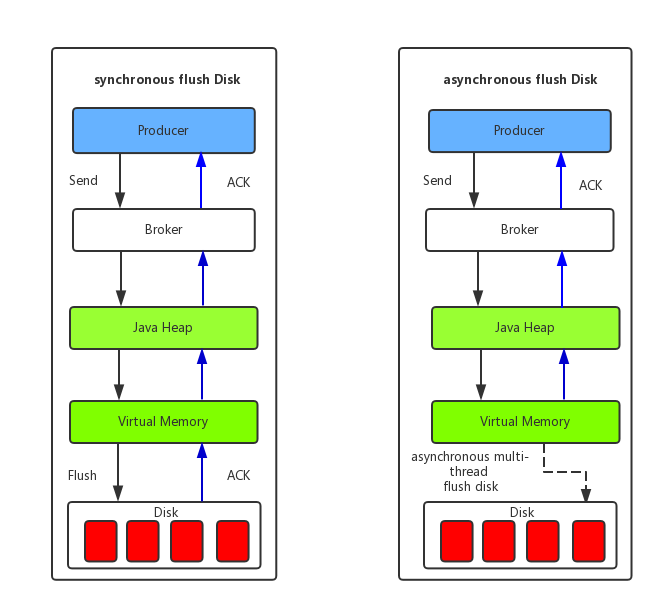

# Message Storage

Message storage is the most complicated and important part of RocketMQ. This section will describe the three aspects of RocketMQ:
* Message storage architecture
* PageCache and memory mapping
* RocketMQ's two different disk flushing methods.

## 1 Message Storage Architecture

The message storage architecture diagram consists of 3 files related to message storage: `CommitLog` file, `ConsumeQueue` file, and `IndexFile`.

* `CommitLog`：The `CommitLog` file stores message body and metadata sent by producer, and the message content is not fixed length. The default size of one `CommitLog` file is 1G, the length of the file name is 20 digits, the left side is zero padded, and the remaining is the starting offset. For example, `00000000000000000000` represents the first file, the starting offset is 0, and the file size is 1G=1073741824, when the first `CommitLog` file is full, the second `CommitLog` file is `00000000001073741824`, the starting offset is 1073741824, and so on. The message is mainly appended to the log file sequentially. When one `CommitLog` file is full, the next will be written.
* `ConsumeQueue`: The `ConsumeQueue` is used to improve the performance of message consumption. Since RocketMQ uses topic-based subscription mode, message consumption is specific to the topic. Traversing the commitlog file to retrieve messages of one topic is very inefficient. The consumer can find the messages to be consumed according to the `ConsumeQueue`. The `ConsumeQueue`(logic consume queue) as an index of the consuming message stores the starting physical offset `offset` in `CommitLog` of the specified topic, the message size `size` and the hash code of the message tag. The `ConsumeQueue` file can be regarded as a topic-based `CommitLog` index file, so the consumequeue folder is organized as follows: `topic/queue/file` three-layer organization structure, the specific storage path is `$HOME/store/consumequeue/{topic}/{queueId }/{fileName}`. The consumequeue file uses a fixed-length design, each entry occupies 20 bytes, which is an 8-byte commitlog physical offset, a 4-byte message length, and an 8-byte tag hashcode. One consumequeue file consists of 0.3 million entries, each entry can be randomly accessed like an array, each `ConsumeQueue` file's size is about 5.72MB.
* `IndexFile`: The `IndexFile` provides a way to query messages by key or time interval. The path of the `IndexFile` is `$HOME/store/index/${fileName}`, the file name `fileName` is named after the timestamp when it was created. One IndexFile's size is about 400M, and it can store 2000W indexes. The underlying storage of `IndexFile` is designed to implement the `HashMap` structure in the file system, so RocketMQ's index file is a hash index.

From the above architecture of the RocketMQ message storage, we can see RocketMQ uses a hybrid storage structure, that is, all the queues in an instance of the broker share a single log file `CommitLog` to store messages. RocketMQ's hybrid storage structure(messages of multiple topics are stored in one CommitLog) uses a separate storage structure for the data and index parts for Producer and Consumer respectively. The Producer sends the message to the Broker, then the Broker persists the message to the CommitLog file synchronously or asynchronously. As long as the message is persisted to the CommitLog on the disk, the message sent by the Producer will not be lost. Because of this, Consumer will definitely have the opportunity to consume this message. When no message can be pulled, the consumer can wait for the next pull. And the server also supports the long polling mode: if a pull request pulls no messages, the Broker can wait for 30 seconds, as long as new message arrives in this interval, it will be returned directly to the consumer. Here, RocketMQ's specific approach is using Broker's background service thread `ReputMessageService` to continuously dispatch requests and asynchronously build ConsumeQueue (Logical Queue) and IndexFile data.

## 2 PageCache and Memory Map

PageCache is a cache of files by the operating system to speed up the reading and writing of files. In general, the speed of sequential read and write files is almost the same as the speed of read and write memory. The main reason is that the OS uses a portion of the memory as PageCache to optimize the performance of the read and write operations. For data writing, the OS will first write to the Cache, and then the `pdflush` kernel thread asynchronously flush the data in the Cache to the physical disk. For data reading, if it can not hit the page cache when reading a file at a time, the OS will read the file from the physical disk and prefetch the data files of other neighboring blocks sequentially.

In RocketMQ, the logic consumption queue `ConsumeQueue` stores less data and is read sequentially. With the help of prefetch of the page cache mechanism, the read performance of the `ConsumeQueue` file is almost close to the memory read, even in the case of message accumulation, it does not affect performance. But for the log data file `CommitLog`, it will generate many random access reads when reading the message content, which seriously affects the performance. If you choose the appropriate IO scheduling algorithm, such as setting the IO scheduling algorithm to "Deadline" (when the block storage uses SSD), the performance of random reads will also be improved.

In addition, RocketMQ mainly reads and writes files through `MappedByteBuffer`. `MappedByteBuffer` uses the `FileChannel` model in NIO to directly map the physical files on the disk to the memory address in user space (`Mmap` method reduces the performance overhead of traditional IO copying disk file data back and forth between the buffer in kernel space and the buffer in user space), it converts the file operation into direct memory address manipulation, which greatly improves the efficiency of reading and writing files (Because of the need to use the memory mapping mechanism, RocketMQ's file storage is fixed-length, making it easy to map the entire file to memory at a time).

## 3 Message Disk Flush

* synchronous flush: As shown above, the RocketMQ's Broker will return a successful `ACK` response to the Producer after the message is truly persisted to disk. Synchronous flushing is a good guarantee for the reliability of MQ messages, but it will have a big impact on performance. Generally, it is suitable for financial business applications.
* asynchronous flush: Asynchronous flushing can take full advantage of the PageCache of the OS, as long as the message is written to the PageCache, the successful `ACK` can be returned to the Producer. The message flushing is performed by the background asynchronous thread, which reduces the read and write delay and improves the performance and throughput of the MQ.
