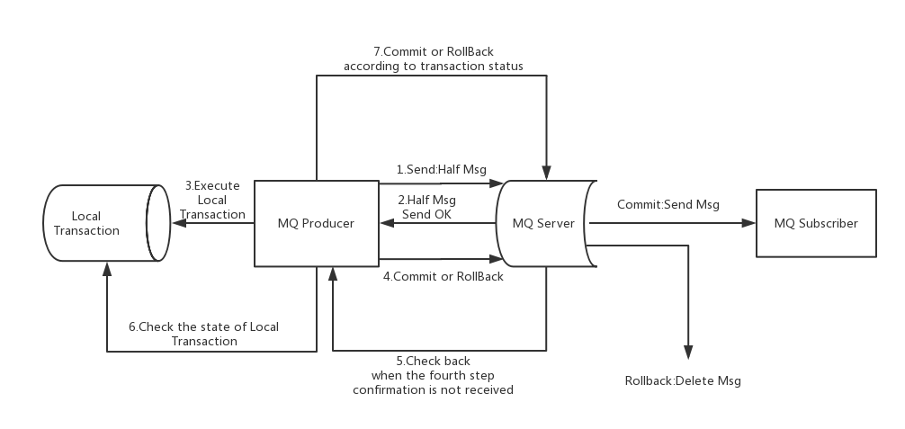
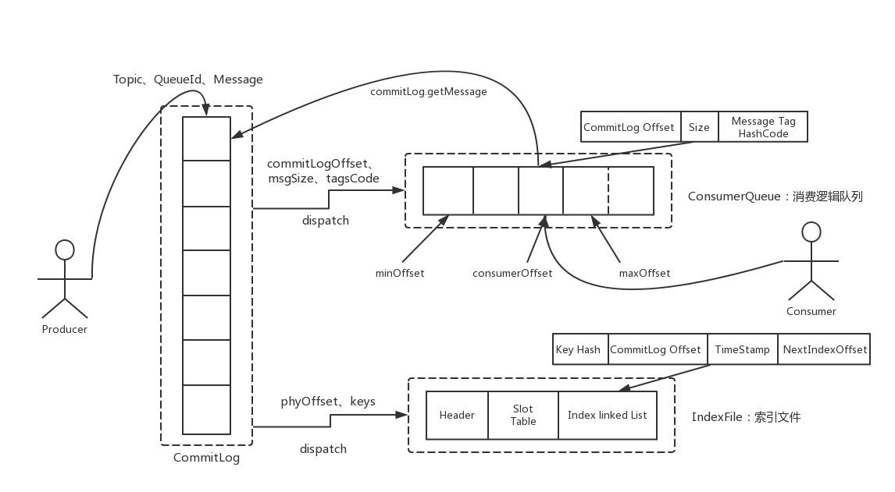
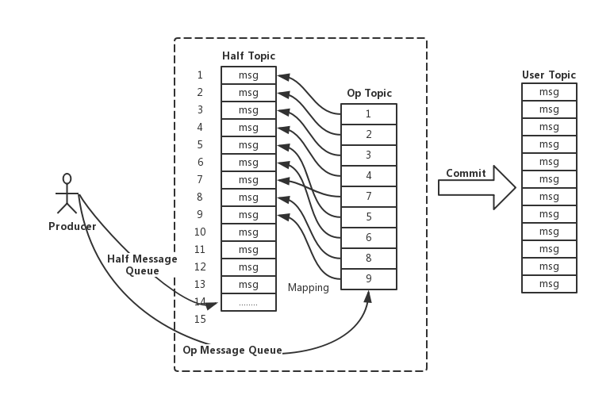

#  Transaction Message
## 1 Transaction Message
Apache RocketMQ supports distributed transaction message from version 4.3.0. RocketMQ implements transaction message by using the protocol of 2PC(two-phase commit), in addition adding a compensation logic to handle timeout-case or failure-case of commit-phase, as shown below.

### 1.1 The Process of RocketMQ Transaction Message
The picture above shows the overall architecture of transaction message, including the sending of message(commit-request phase), the sending of commit/rollback(commit phase) and the compensation process.

1 The sending of message and Commit/Rollback.  
  (1) Sending the message(named Half message in RocketMQ)  
  (2) The server responds the writing result(success or failure) of Half message.  
  (3) Handle local transaction according to the result(local transaction won't be executed when the result is failure).  
  (4) Sending Commit/Rollback to broker according to the result of local transaction(Commit will generate message index and make the message visible to consumers).

2 Compensation process  
  (1) For a transaction message without a Commit/Rollback (means the message in the pending status), a "back-check" request is initiated from the broker.  
  (2) The Producer receives the "back-check" request and checks the status of the local transaction corresponding to the "back-check" message.  
  (3) Redo Commit or Rollback based on local transaction status.
The compensation phase is used to resolve the timeout or failure case of the message Commit or Rollback.

### 1.2 The design of RocketMQ Transaction Message
1 Transaction message is invisible to users in first phase(commit-request phase)   
  
  Upon on the main process of transaction message, the message of first phase is invisible to the user. This is also the biggest difference from normal message. So how do we write the message while making it invisible to the user? And below is the solution of RocketMQ: if the message is a Half message, the topic and queueId of the original message will be backed up, and then changes the topic to RMQ_SYS_TRANS_HALF_TOPIC. Since the consumer group does not subscribe to the topic, the consumer cannot consume the Half message. Then RocketMQ starts a timing task, pulls the message for RMQ_SYS_TRANS_HALF_TOPIC, obtains a channel according to producer group and sends a back-check to query local transaction status, and decide whether to submit or roll back the message according to the status.  
  
  In RocketMQ, the storage structure of the message in the broker is as follows. Each message has corresponding index information. The Consumer reads the content of the message through the secondary index of the ConsumeQueue. The flow is as follows:

  The specific implementation strategy of RocketMQ is: if the transaction message is written, topic and queueId of the message are replaced, and the original topic and queueId are stored in the properties of the message. Because the replace of the topic, the message will not be forwarded to the Consumer Queue of the original topic, and the consumer cannot perceive the existence of the message and will not consume it. In fact, changing the topic is the conventional method of RocketMQ(just recall the implementation mechanism of the delay message).

2 Commit/Rollback operation and introduction of Op message  
  
  After finishing writing a message that is invisible to the user in the first phase, here comes two cases in the second phase. One is Commit operation, after which the message needs to be visible to the user; the other one is Rollback operation, after which the first phase message(Half message) needs to be revoked. For the case of Rollback, since first-phase message itself is invisible to the user, there is no need to actually revoke the message (in fact, RocketMQ can't actually delete a message because it is a sequential-write file). But still some operation needs to be done to identity the final status of the message, to differ it from pending status message. To do this, the concept of "Op message" is introduced, which means the message has a certain status(Commit or Rollback). If a transaction message does not have a corresponding Op message, the status of the transaction is still undetermined (probably the second-phase failed). By introducing the Op message, the RocketMQ records an Op message for every Half message regardless it is Commit or Rollback. The only difference between Commit and Rollback is that when it comes to Commit, the index of the Half message is created before the Op message is written.

3 How Op message stored and the correspondence between Op message and Half message  
  
  RocketMQ writes the Op message to a specific system topic(RMQ_SYS_TRANS_OP_HALF_TOPIC) which will be created via the method - TransactionalMessageUtil.buildOpTopic(); this topic is an internal Topic (like the topic of RMQ_SYS_TRANS_HALF_TOPIC) and will not be consumed by the user. The content of the Op message is the physical offset of the corresponding Half message. Through the Op message we can index to the Half message for subsequent check-back operation.

4 Index construction of Half messages  
  
  When performing Commit operation of the second phase, the index of the Half message needs to be built. Since the Half message is written to a special topic(RMQ_SYS_TRANS_HALF_TOPIC) in the first phase of 2PC, so it needs to be read out from the special topic when building index, and replace the topic and queueId with the real target topic and queueId, and then write through a normal message that is visible to the user. Therefore, in conclusion, the second phase recovers a complete normal message using the content of the Half message stored in the first phase, and then goes through the message-writing process.

5 How to handle the message failed in the second phase？
  
  If commit/rollback phase fails, for example, a network problem causes the Commit to fail when you do Commit. Then certain strategy is required to make sure the message finally commit. RocketMQ uses a compensation mechanism called "back-check". The broker initiates a back-check request for the message in pending status, and sends the request to the corresponding producer side (the same producer group as the producer group who sent the Half message). The producer checks the status of local transaction and redo Commit or Rollback. The broker performs the back-check by comparing the RMQ_SYS_TRANS_HALF_TOPIC messages and the RMQ_SYS_TRANS_OP_HALF_TOPIC messages and advances the checkpoint(recording those transaction messages that the status are certain).

  RocketMQ does not back-check the status of transaction messages endlessly. The default time is 15. If the transaction status is still unknown after 15 times, RocketMQ will roll back the message by default.
