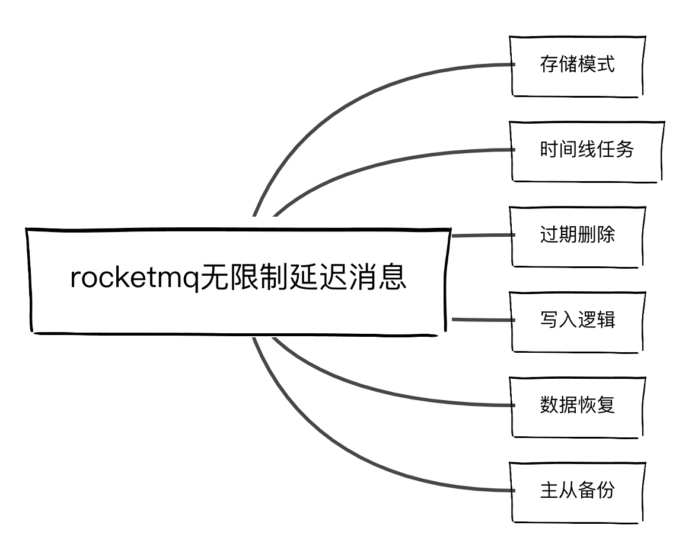
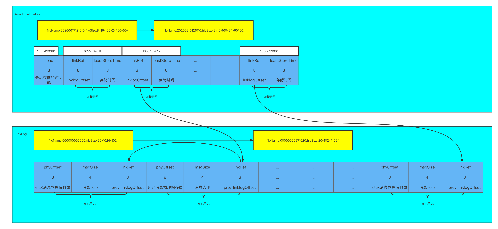
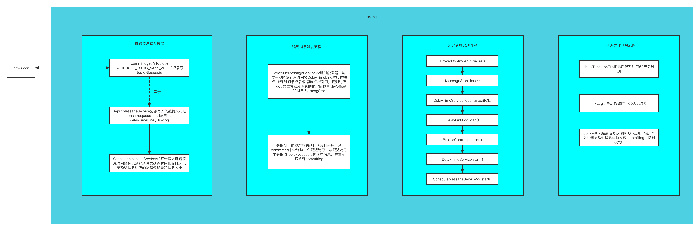

## Idea
Build a chronological file in seconds of delayed messages delayTimeLine,
different delay messages are mapped to the corresponding time unit of the file,
Messages with the same delay time are added to the delaylinklog log and written sequentially.
The asynchronous time thread looks for the delay message that has expired in the current second according to the current time seconds, reads and restores the original message and puts it back into the commitlog

## Design
Content involved：


Storage structure design：


technological process：


## Problem
- Second level trigger if there are too many tasks in the current second and the execution time exceeds 1 second, the tasks in the next second will be affected (you can consider sending the found delay messages asynchronously and putting them back into the commitlog)
- The file deletion time of the commitlog, because the delayed messages are also stored in the commitlog. By default, the commitlog will be deleted after 3 days without modification. It is a problem to ensure that the performance messages within 2 months are not lost

For the second question, there are currently three solutions

Scheme I：
Modify the expiration time of the commitlog to 2 months, which is simple and crude

Scheme II：
When the commitlog expires for deletion, traverse each message of the file to be deleted. If it is a delayed message, put it back into the commitlog. However, this will increase the reference link of the linklog, and the delayed message may have been consumed

Scheme III：
Write a delaycommitlog again in the defaultmessagestore message storage module. Select whether to write the commitlog or delaycommitlog according to whether the message route is delayed. This will increase the load. In addition, the master-slave replication should also be considered

## Test
Consume delay message
```java
// org.apache.rocketmq.example.delay.DelayTimeMessageConsumer

package org.apache.rocketmq.example.delay;

import org.apache.rocketmq.client.consumer.DefaultMQPushConsumer;
import org.apache.rocketmq.client.consumer.listener.ConsumeConcurrentlyStatus;
import org.apache.rocketmq.client.consumer.listener.MessageListenerConcurrently;
import org.apache.rocketmq.common.message.MessageExt;

public class DelayTimeMessageConsumer {

    public static final String CONSUMER_GROUP = "DelayExampleConsumer";
    public static final String DEFAULT_NAMESRVADDR = "127.0.0.1:9876";
    public static final String TOPIC = "TopicTest";

    public static void main(String[] args) throws Exception {
        // Instantiate message consumer
        DefaultMQPushConsumer consumer = new DefaultMQPushConsumer(CONSUMER_GROUP);

        // Uncomment the following line while debugging, namesrvAddr should be set to your local address
        consumer.setNamesrvAddr(DEFAULT_NAMESRVADDR);

        // Subscribe topics
        consumer.subscribe(TOPIC, "*");
        // Register message listener
        consumer.registerMessageListener((MessageListenerConcurrently) (messages, context) -> {
            for (MessageExt message : messages) {
                // Print approximate delay time period
                System.out.printf("message[msgId=%s %d  ms later, content=%s]\n", message.getMsgId(),
                    System.currentTimeMillis() - message.getBornTimestamp(), new String(message.getBody()));
            }
            return ConsumeConcurrentlyStatus.CONSUME_SUCCESS;
        });
        // Launch consumer
        consumer.start();
        //info:to see the time effect, run the consumer first , it will wait for the msg
        //then start the producer
    }
}

```


Production delay message
```java
// org.apache.rocketmq.example.delay.DelayTimeMessageProducer


package org.apache.rocketmq.example.delay;

import org.apache.rocketmq.client.producer.DefaultMQProducer;
import org.apache.rocketmq.client.producer.SendResult;
import org.apache.rocketmq.common.UtilAll;
import org.apache.rocketmq.common.message.Message;

public class DelayTimeMessageProducer {

    public static final String PRODUCER_GROUP = "DelayExampleProducerGroup";
    public static final String DEFAULT_NAMESRVADDR = "127.0.0.1:9876";
    public static final String TOPIC = "TopicTest";

    public static void main(String[] args) throws Exception {
        // Instantiate a producer to send scheduled messages
        DefaultMQProducer producer = new DefaultMQProducer(PRODUCER_GROUP);

        // Uncomment the following line while debugging, namesrvAddr should be set to your local address
        producer.setNamesrvAddr(DEFAULT_NAMESRVADDR);

        // Launch producer
        producer.start();
        int totalMessagesToSend = 10;
        for (int i = 0; i < totalMessagesToSend; i++) {
            final long currentTimeMillis = System.currentTimeMillis();
            Message message = new Message(TOPIC,
                ("Hello scheduled message " + i+" hour, start time "+currentTimeMillis +", "+ UtilAll.timeMillisToHumanString(currentTimeMillis)).getBytes());
            // This message will be delivered to consumer i hour later.
            message.setDelayTime(i*60*60*1000);
            // Send the message
            SendResult result = producer.send(message);
            System.out.print(result);
        }

        // Shutdown producer after use.
        producer.shutdown();
    }

}

```