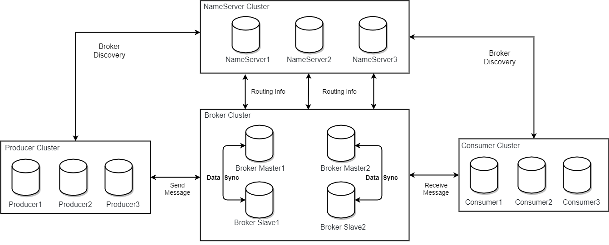
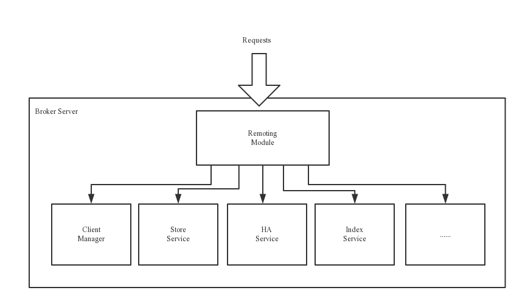
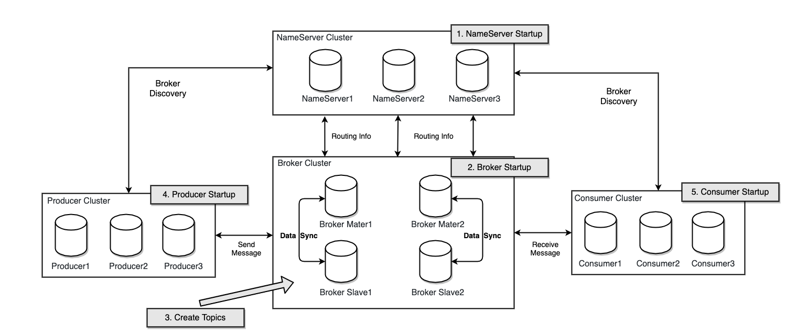

# Architecture design

## Technology Architecture

The RocketMQ architecture is divided into four parts, as shown in the figure above:

- Producer：The role of message publishing supports distributed cluster mode deployment. Producer selects the corresponding Broker cluster queue for message delivery through MQ's load balancing module. The delivery process supports fast failure and low latency.

- Consumer：The role of message consumption supports distributed cluster deployment. Support push, pull two modes to consume messages. It also supports cluster mode and broadcast mode consumption, and it provides a real-time message subscription mechanism to meet the needs of most users.

- NameServer：NameServer is a very simple Topic routing registry with a role similar to ZooKeeper in Dubbo, which supports dynamic registration and discovery of Broker. It mainly includes two functions: Broker management, NameServer accepts the registration information of the Broker cluster and saves it as the basic data of the routing information. Then provide a heartbeat detection mechanism to check whether the broker is still alive; routing information management, each NameServer will save the entire routing information about the Broker cluster and the queue information for the client query. Then the Producer and Consumer can know the routing information of the entire Broker cluster through the NameServer, so as to deliver and consume the message. The NameServer is usually deployed in a cluster mode, and each instance does not communicate with each other. Broker registers its own routing information with each NameServer, so each NameServer instance stores a complete routing information. When a NameServer is offline for some reason, the Broker can still synchronize its routing information with other NameServers. The Producer and Consumer can still dynamically sense the information of the Broker's routing.

- BrokerServer：Broker is responsible for the storage, delivery and query of messages and high availability guarantees. In order to achieve these functions, Broker includes the following important sub-modules.
1. Remoting Module：The entire broker entity handles requests from the clients side.
2. Client Manager：Topic subscription information for managing the client (Producer/Consumer) and maintaining the Consumer
3. Store Service：Provides a convenient and simple API interface for handling message storage to physical hard disks and query functions.
4. HA Service：Highly available service that provides data synchronization between Master Broker and Slave Broker.
5. Index Service：The message delivered to the Broker is indexed according to a specific Message key to provide a quick query of the message.

## Deployment architecture

### RocketMQ Network deployment features

- NameServer is an almost stateless node that can be deployed in a cluster without any information synchronization between nodes.

- The broker deployment is relatively complex. The Broker is divided into the Master and the Slave. One Master can correspond to multiple Slaves. However, one Slave can only correspond to one Master. The correspondence between the Master and the Slave is defined by specifying the same BrokerName and different BrokerId. The BrokerId is 0. Indicates Master, non-zero means Slave. The Master can also deploy multiple. Each broker establishes a long connection with all nodes in the NameServer cluster, and periodically registers Topic information to all NameServers. Note: The current RocketMQ version supports a Master Multi Slave on the deployment architecture, but only the slave server with BrokerId=1 will participate in the read load of the message.

- The Producer establishes a long connection with one of the nodes in the NameServer cluster (randomly selected), periodically obtains Topic routing information from the NameServer, and establishes a long connection to the Master that provides the Topic service, and periodically sends a heartbeat to the Master. Producer is completely stateless and can be deployed in a cluster.

- The Consumer establishes a long connection with one of the nodes in the NameServer cluster (randomly selected), periodically obtains Topic routing information from the NameServer, and establishes a long connection to the Master and Slave that provides the Topic service, and periodically sends heartbeats to the Master and Slave. The Consumer can subscribe to the message from the Master or subscribe to the message from the Slave. When the consumer pulls the message to the Master, the Master server will generate a read according to the distance between the offset and the maximum offset. I/O), and whether the server is readable or not, the next time it is recommended to pull from the Master or Slave.

Describe the cluster workflow in conjunction with the deployment architecture diagram:

- Start the NameServer, listen to the port after the NameServer, and wait for the Broker, Producer, and Consumer to connect, which is equivalent to a routing control center.
- The Broker starts, keeps a long connection with all NameServers, and sends heartbeat packets periodically. The heartbeat packet contains the current broker information (IP+ port, etc.) and stores all Topic information. After the registration is successful, there is a mapping relationship between Topic and Broker in the NameServer cluster.
- Before sending and receiving a message, create a Topic. When creating a Topic, you need to specify which Brokers the Topic should be stored on, or you can automatically create a Topic when sending a message.
- Producer sends a message. When starting, it first establishes a long connection with one of the NameServer clusters, and obtains from the NameServer which Brokers are currently sent by the Topic. Polling selects a queue from the queue list and then establishes with the broker where the queue is located. Long connection to send a message to the broker.
- The Consumer is similar to the Producer. It establishes a long connection with one of the NameServers, obtains which Brokers the current Topic exists on, and then directly establishes a connection channel with the Broker to start consuming messages.
