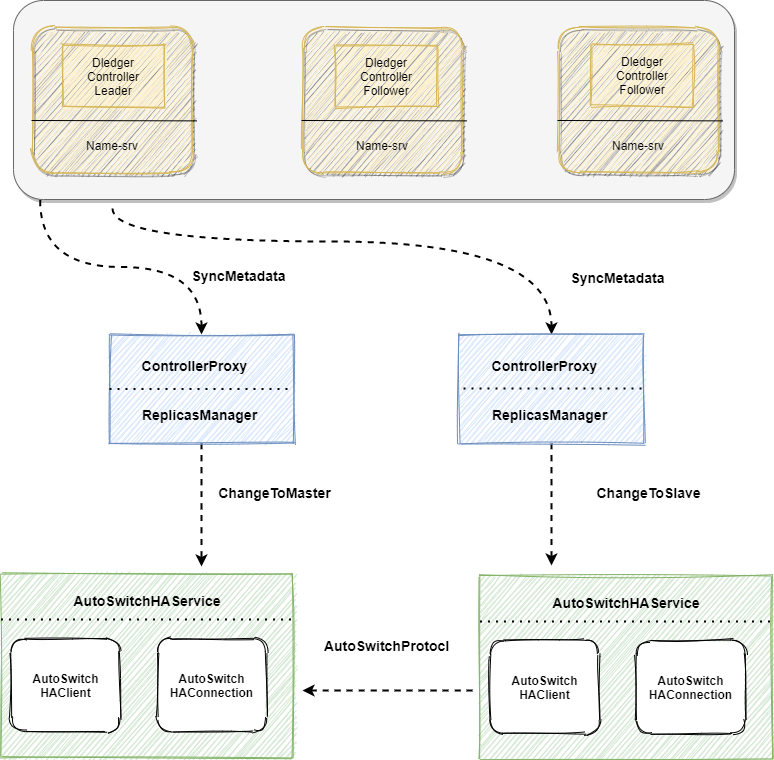
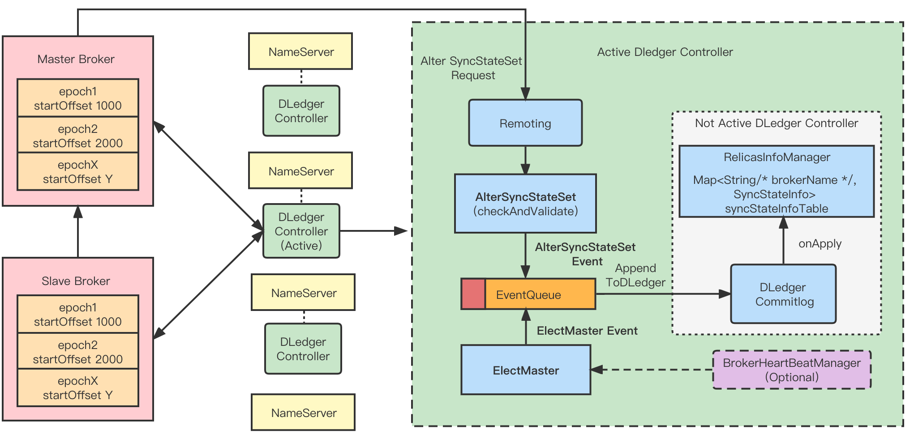
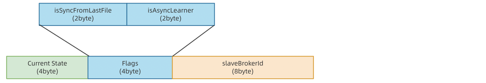
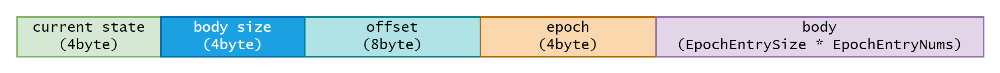
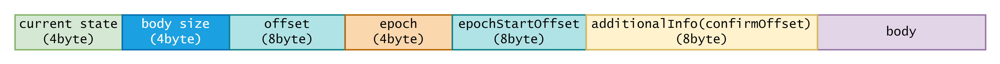
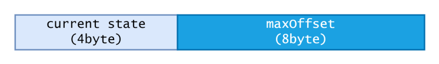

# Background

In the current RocketMQ Raft mode, the DLedger Commitlog is mainly used to replace the original Commitlog, enabling the Commitlog to have the ability to elect and replicate. However, this also causes some problems:

- In the Raft mode, the number of replicas within the Broker group must be three or more, and the ACK of the replicas must also follow the majority protocol.
- RocketMQ has two sets of HA replication processes, and the replication in Raft mode cannot utilize RocketMQ's native storage capability.

Therefore, we hope to use DLedger to implement a consistency module (DLedger Controller) based on Raft, and use it as an optional leader election component. It can be deployed independently or embedded in the Nameserver. The Broker completes the election of the Master through interaction with the Controller, thus solving the above problems. We refer to this new mode as the Controller mode.

# Architecture

### Core idea



- The following is a description of the core architecture of the Controller mode, as shown in the figure:
  - DledgerController: Using DLedger, a DLedger controller that ensures the consistency of metadata is constructed. The Raft election will select an Active DLedger Controller as the main controller. The DLedger Controller can be embedded in the Nameserver or deployed independently. Its main function is to store and manage the SyncStateSet list of Brokers, and actively issue scheduling instructions to switch the Master of the Broker when the Master of the Broker is offline or network isolated.
  - SyncStateSet: Mainly represents a set of Slave replicas following the Master in a broker replica group, with the main criterion for judgment being the gap between the Master and the Slave. When the Master is offline, we will select a new Master from the SyncStateSet list. The SyncStateSet list is mainly initiated by the Master Broker. The Master completes the Shrink and Expand of the SyncStateSet through a periodic task to determine and synchronize the SyncStateSet, and initiates an Alter SyncStateSet request to the election component Controller.
  - AutoSwitchHAService: A new HAService that, based on DefaultHAService, supports the switching of BrokerRole and the mutual conversion between Master and Slave (under the control of the Controller). In addition, this HAService unifies the log replication process and truncates the logs during the HA HandShake stage.
  - ReplicasManager: As an intermediate component, it serves as a link between the upper and lower levels. Upward, it can regularly synchronize control instructions from the Controller, and downward, it can regularly monitor the state of the HAService and modify the SyncStateSet at the appropriate time. The ReplicasManager regularly synchronizes metadata about the Broker from the Controller, and when the Controller elects a new Master, the ReplicasManager can detect the change in metadata and switch the BrokerRole.

## DLedgerController core design



- The following is a description of the core design of the DLedgerController:
  - DLedgerController can be embedded in Namesrv or deployed independently.
  - Active DLedgerController is the Leader elected by DLedger. It will accept event requests from clients and initiate consensus through DLedger, and finally apply them to the in-memory metadata state machine.
  - Not Active DLedgerController, also known as the Follower role, will replicate the event logs from the Active DLedgerController through DLedger and then apply them directly to the state machine.

## Log replication

### Basic concepts and processes

In order to unify the log replication process, distinguish the log replication boundary of each Master, and facilitate log truncation, the concept of MasterEpoch is introduced, which represents the current Master's term number (similar to the meaning of Raft Term).

For each Master, it has a MasterEpoch and a StartOffset, which respectively represent the term number and the starting log offset of the Master.

It should be noted that the MasterEpoch is determined by the Controller and is monotonically increasing.

In addition, we have introduced the EpochFile, which is used to store the \<Epoch, StartOffset\> sequence.

**When a Broker becomes the Master, it will:**

- Truncate the Commitlog to the boundary of the last message.
- Persist the latest \<MasterEpoch, startoffset\> to the EpochFile, where startOffset is the current CommitLog's MaxPhyOffset.
- Then the HAService listens for connections and creates the HAConnection to interact with the Slave to complete the process.

**When a Broker becomes the Slave, it will:**

Ready stage:

- Truncate the Commitlog to the boundary of the last message.
- Establish a connection with the Master.

Handshake stage:

- Perform log truncation, where the key is for the Slave to compare its local epoch and startOffset with the Master to find the log truncation point and perform log truncation.

Transfer stage:

- Synchronize logs from the Master.

### Truncation algorithm

The specific log truncation algorithm flow is as follows:

- During the Handshake stage, the Slave obtains the Master's EpochCache from the Master.
- The Slave compares the obtained Master EpochCache \<Startoffset, Endoffset\>, and compares them with the local cache from back to front. If the Epoch and StartOffset of the two are equal, the Epoch is valid, and the truncation point is the smaller Endoffset between them. After truncation, the \<Epoch, Startoffse\t> information is corrected and enters the Transfer stage. If they are not equal, the previous epoch of the Slave is compared until the truncation point is found.

```java
slave：TreeMap<Epoch, Pair<startOffset,endOffset>> epochMap;
Iterator iterator = epochMap.entrySet().iterator();
truncateOffset = -1;

//The epochs are sorted from largest to smallest
while (iterator.hasNext()) {
    Map.Entry<Epoch, Pair<startOffset,endOffset>> curEntry = iterator.next();
    Pair<startOffset,endOffset> masterOffset=
    findMasterOffsetByEpoch(curEntry.getKey());
    
    if(masterOffset != null && 
            curEntry.getKey().getObejct1() == masterOffset.getObejct1()) {
        truncateOffset = Math.min(curEntry.getKey().getObejct2(), masterOffset.getObejct2());
        break;
   }
}
```

### Replication process

Since HA replicates logs based on stream, we cannot distinguish the boundaries of the logs (that is, a batch of transmitted logs may span multiple MasterEpochs), and the Slave cannot detect changes in MasterEpoch and cannot timely modify EpochFile.

Therefore, we have made the following improvements:

When the Master transfers logs, it ensures that a batch of logs sent at a time is in the same epoch, but not spanning multiple epochs. We can add two variables in WriteSocketService:

- currentTransferEpoch: represents which epoch WriteSocketService.nextTransferFromWhere belongs to
- currentTransferEpochEndOffset: corresponds to the end offset of currentTransferEpoch. If currentTransferEpoch == MaxEpoch, then currentTransferEpochEndOffset= -1, indicating no boundary.

When WriteSocketService transfers the next batch of logs (assuming the total size of this batch is size), if it finds that nextTransferFromWhere + size > currentTransferEpochEndOffset, it sets selectMappedBufferResult limit to currentTransferEpochEndOffset. Finally, modify currentTransferEpoch and currentTransferEpochEndOffset to the next epoch.

Correspondingly, when the Slave receives logs, if it finds a change in epoch from the header, it records it in the local epoch file.

### Replication protocol

According to the above, we can know the AutoSwitchHaService protocol divides log replication into multiple stages. Below is the protocol for the HaService.

#### Handshake stage

1.AutoSwitchHaClient (Slave) will send a HandShake packet to the Master as follows：



`current state(4byte) + Two flags(4byte) + slaveBrokerId(8byte)`

- `Current state` represents the current HAConnectionState, which is HANDSHAKE.

- Two flags are two status flags, where `isSyncFromLastFile` indicates whether to start copying from the Master's last file, and `isAsyncLearner` indicates whether the Slave is an asynchronous copy and joins the Master as a Learner.

- `slaveBrokerId` represent the brokerId of the Slave, which will be used later to join the SyncStateSet.

2.AutoSwitchHaConnection (Master) will send a HandShake packet back to the Slave as follows:



`current state(4byte) + body size(4byte) + offset(8byte) + epoch(4byte) + body`

- `Current state` represents the current HAConnectionState, which is HANDSHAKE.
- `Body size` represents the length of the body.
- `Offset` represents the maximum offset of the log on the Master side.
- `Epoch` represents the Master's Epoch.
- The Body contains the EpochEntryList on the Master side.

After the Slave receives the packet sent back by the Master, it will perform the log truncation process described above locally.

#### Transfer stage

1.AutoSwitchHaConnection (Master) will continually send log packets to the Slave as follows：



`current state(4byte) + body size(4byte) + offset(8byte) + epoch(4byte)  + epochStartOffset(8byte) + additionalInfo(confirmOffset) (8byte)+ body`

- `Current state`: represents the current HAConnectionState, which is Transfer.
- `Body size`: represents the length of the body.
- `Offset`: the starting offset of the current batch of logs.
- `Epoch`: represents the MasterEpoch to which the current batch of logs belongs.
- `epochStartOffset`: represents the StartOffset of the MasterEpoch corresponding to the current batch of logs.
- `confirmOffset`: represents the minimum offset among replicas in SyncStateSet.
- `Body`: logs.

2.AutoSwitchHaClient (Slave) will send an ACK packet to the Master：



` current state(4byte) + maxOffset(8byte)`

- `Current state`: represents the current HAConnectionState, which is Transfer.
- `MaxOffset`: represents the current maximum log offset of the Slave.

## Elect Master 

### Basic process

ELectMaster mainly selects a new Master from the SyncStateSet list when the Master of a Broker replica group is offline or inaccessible. This event is initiated by the Controller itself or through the `electMaster` operation command.

Whether the Controller is deployed independently or embedded in Namesrv, it listens to the connection channels of each Broker. If a Broker channel becomes inactive, it checks whether the Broker is the Master, and if so, it triggers the Master election process.

The process of electing a Master is relatively simple. We just need to select one from the SyncStateSet list corresponding to the group of Brokers and make it the new Master, and apply the result to the in-memory metadata through the DLedger consensus. Finally, the result is notified to the corresponding Broker replica group.

### SyncStateSet change

SyncStateSet is an important basis for electing a Master. Changes to the SyncStateSet list are mainly initiated by the Master Broker. The Master completes the Shrink and Expand of SyncStateSet through a periodic task and initiates an Alter SyncStateSet request to the election component Controller during the synchronization process.

#### Shrink

Shrink SyncStateSet refers to the removal of replicas from the SyncStateSet replica set that are significantly behind the Master, based on the following criteria:

- Increase the haMaxTimeSlaveNotCatchUp parameter.
- HaConnection records the last time the Slave caught up with the Master's timestamp, lastCaughtUpTimeMs, which means: every time the Master sends data (transferData) to the Slave, it records its current MaxOffset as lastMasterMaxOffset and the current timestamp lastTransferTimeMs.
- When ReadSocketService receives slaveAckOffset, if slaveAckOffset >= lastMasterMaxOffset, it updates lastCaughtUpTimeMs to lastTransferTimeMs.
- The Master scans each HaConnection through a periodic task and if (cur_time - connection.lastCaughtUpTimeMs) > haMaxTimeSlaveNotCatchUp, the Slave is Out-of-sync.
- If a Slave is detected to be out of sync, the master immediately reports SyncStateSet to the Controller, thereby shrinking SyncStateSet.

#### Expand

If a Slave replica catches up with the Master, the Master needs to timely alter SyncStateSet with the Controller. The condition for adding to SyncStateSet is slaveAckOffset >= ConfirmOffset (the minimum value of MaxOffset among all replicas in the current SyncStateSet).

## Reference

[RIP-44](https://github.com/apache/rocketmq/wiki/RIP-44-Support-DLedger-Controller)
