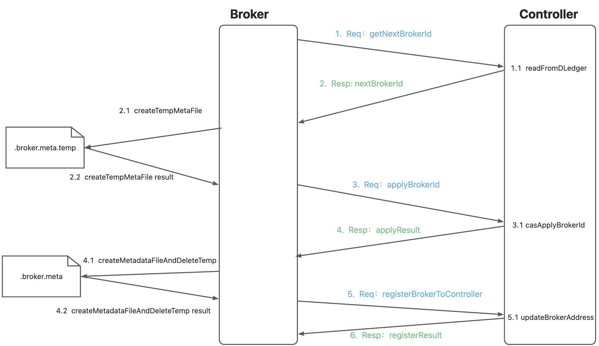
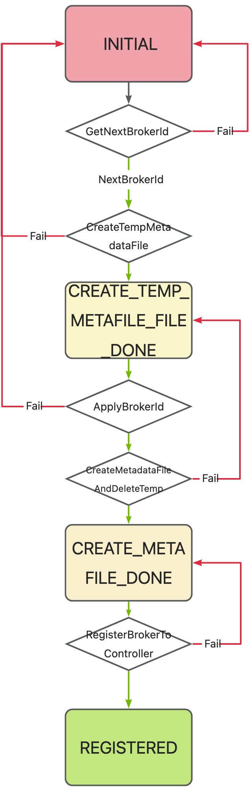
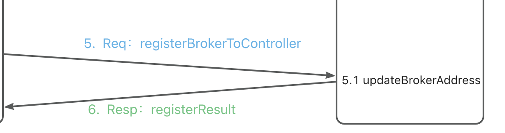
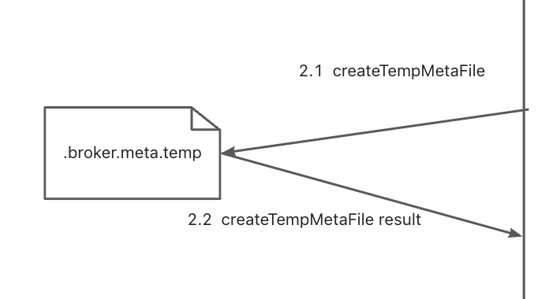
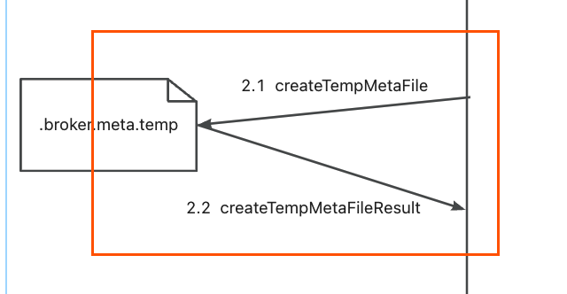

# Persistent unique BrokerId

## Current Issue

Currently, `BrokerAddress` is used as the unique identifier for the Broker in Controller mode, which causes the following problems：

*   In a container environment, each restart or upgrade of the Broker may result in an IP address change, making it impossible to associate the previous `BrokerAddress` records with the restarted Broker, such as `ReplicaInfo`, `SyncStateSet`, and other data.

## Improvement Plan

In the Controller side, `BrokerName:BrokerId` is used as the unique identifier instead of `BrokerAddress`. Also, `BrokerId` needs to be persistently stored. Since `ClusterName` and `BrokerName` are both configured in the configuration file when starting up, only the allocation and persistence of `BrokerId` need to be addressed.When the Broker first comes online, only the `ClusterName`, `BrokerName`, and its own `BrokerAddress` configured in the configuration file are available. Therefore, a unique identifier, `BrokerId`, that is determined throughout the lifecycle of the entire cluster needs to be negotiated with the Controller. The `BrokerId` is assigned starting from 1. When the Broker is selected as the Master, it will be re-registered in the Name Server, and at this point, to be compatible with the previous non-HA Master-Slave architecture, the `BrokerId` needs to be temporarily changed to 0 (where id 0 previously represented that the Broker was a Master).

### Online Process

#### 1. GetNextBrokerId Request

Send a GetNextBrokerId request to the Controller to obtain the next available BrokerId (allocated starting from 1).

#### 1.1 ReadFromDLedger

Upon receiving the request, the Controller uses DLedger to retrieve the NextBrokerId data from the state machine.

#### 2. GetNextBrokerId Response

The Controller returns the NextBrokerId to the Broker.

#### 2.1 CreateTempMetaFile

After receiving the NextBrokerId, the Broker creates a temporary file .broker.meta.temp, which records the NextBrokerId (the expected BrokerId to be applied) and generates a RegisterCode (used for subsequent identity verification), which is also persisted to the temporary file.

#### 3. ApplyBrokerId Request

The Broker sends an ApplyBrokerId request to the Controller, carrying its basic data (ClusterName, BrokerName, and BrokerAddress) and the expected BrokerId and RegisterCode.

#### 3.1 CASApplyBrokerId

The Controller writes this event to DLedger. When the event (log) is applied to the state machine, it checks whether the BrokerId can be applied (if the BrokerId has already been allocated and is not assigned to the Broker, the application fails). It also records the relationship between the BrokerId and RegisterCode.

#### 4. ApplyBrokerId Response

If the previous step successfully applies the BrokerId, the Controller returns success to the Broker; otherwise, it returns the current NextBrokerId.

#### 4.1 CreateMetaFileFromTemp

If the BrokerId is successfully applied in the previous step, it can be considered as successfully allocated on the Broker side. At this point, the information of this BrokerId needs to be persisted. This is achieved by atomically deleting the .broker.meta.temp file and creating a .broker.meta file. These two steps need to be atomic operations.

> After the above process, the Broker and Controller that come online for the first time successfully negotiate a BrokerId that both sides agree on and persist it.

#### 5. RegisterBrokerToController Request

The previous steps have correctly negotiated the BrokerId, but at this point, it is possible that the BrokerAddress saved on the Controller side is the BrokerAddress when the last Broker came online. Therefore, the BrokerAddress needs to be updated now by sending a RegisterBrokerToController request with the current BrokerAddress.

#### 5.1 UpdateBrokerAddress

The Controller compares the BrokerAddress currently saved in the Controller state machine for this Broker. If it does not match the BrokerAddress carried in the request, it updates it to the BrokerAddress in the request.

#### 6. RegisterBrokerToController Response

After updating the BrokerAddress, the Controller can return the master-slave information of the Broker-set where the Broker is located, to notify the Broker to perform the corresponding identity transformation.

### Registration status rotation

### Fault tolerance

> If various crashes occur during the normal online process, the following process ensures the correct allocation of BrokerId.

#### Node online after normal restart

If it is a normal restart, then a unique BrokerId has already been negotiated by both sides, and the broker.meta already has the data for that BrokerId. Therefore, the registration process is not necessary and the subsequent process can be continued directly. That is, continue to come online from RegisterBrokerToController.

#### CreateTempMetaFile Failure

If the process shown in the figure fails, then after the Broker restarts, the Controller's state machine has not allocated any BrokerId. The Broker itself has not saved any data. Therefore, just restart the process from the beginning as described above.

#### CreateTempMetaFile success，ApplyBrokerId fail

If the Controller already considers the ApplyBrokerId request to be incorrect (i.e., requesting to allocate a BrokerId that has already been allocated and the RegisterCode is not equal), and at this time returns the current NextBrokerId to the Broker, then the Broker directly deletes the .broker.meta.temp file and goes back to step 2 to restart the process and subsequent steps.

#### ApplyBrokerId success，CreateMetaFileFromTemp fail

The above situation can occur in the ApplyResult loss, and in the CAS deletion and creation of broker.meta failure processes. After restart, the Controller side thinks that our ApplyBrokerId process has succeeded and has already modified the BrokerId allocation data in the state machine. So at this point, we can directly start step 3 again, which is to send the ApplyBrokerId request.

Since we have the .broker.meta.temp file, we can retrieve the BrokerId and RegisterCode that were successfully applied on the Controller side, and send them directly to the Controller. If the BrokerId exists in the Controller and the RegisterCode is equal to the one in the request, it is considered successful.

### After successful registration, use the BrokerId as the unique identifier.

After successful registration, all subsequent requests and state records for the Broker are identified by BrokerId. The recording of heartbeats and other data is also identified by BrokerId. At the same time, the Controller side will also record the BrokerAddress of the current BrokerId, which will be used to notify the Broker of changes in state such as switching between master and slave.

## Upgrade plan

To upgrade to version 4.x, follow the 5.0 upgrade documentation process.
For upgrading from the non-persistent BrokerId version in 5.0.0 or 5.1.0 to the persistent BrokerId version 5.1.1 or above, follow the following steps:

### Upgrade Controller

1.  Shut down the old version of the Controller group.
2.  Clear the Controller data, i.e., the data files located by default in `~/DLedgerController`.
3.  Bring up the new version of the Controller group.

> During the above Controller upgrade process, the Broker can still run normally but cannot be switched.

### Upgrade Broker

1.  Shut down the Broker slave node.
2.  Shut down the Broker master node.
3.  Delete all the Epoch files for all Brokers, i.e., the ones located at `~/store/epochFileCheckpoint` and `~/store/epochFileCheckpoint.bak` by default.
4.  Bring up the original master Broker and wait for it to be elected as the new master (you can use the `getSyncStateSet` command in the `admin` tool to check).
5.  Bring up all the original slave Brokers.

> It is recommended to shut down the slave Brokers before shutting down the master Broker and bring up the original master Broker before bringing up the original slave Brokers. This will ensure that the original master-slave relationship is maintained. If you need to change the master-slave relationship after the upgrade, you need to make sure that the CommitLog of the old master and slave Brokers are aligned before shutting them down, otherwise data may be truncated and lost.

### Compatibility

|                                    | Controller for version 5.1.0 and below              | Controller for version 5.1.1 and above                                               |
|------------------------------------|--------------------------------| ------------------------------------------------------------ |
| Broker for version 5.1.0 and below | Normal operation and switch.   | Normal operation and no switch if the master-slave relationship is already determined. The Broker cannot be brought up if it is restarted. |
| Broker for version 5.1.1 and above | Cannot be brought up normally. | Normal operation and switch.                                 |