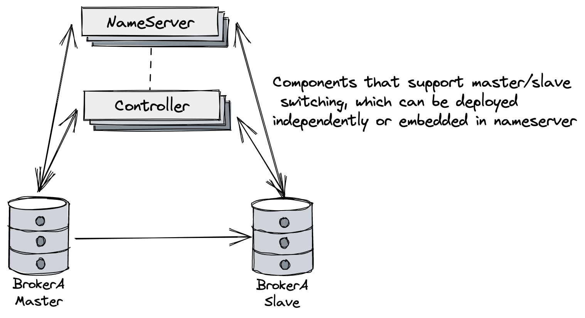
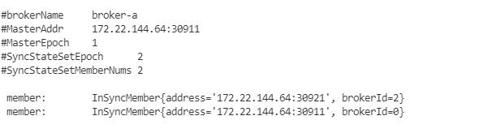
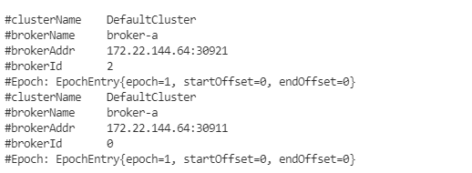
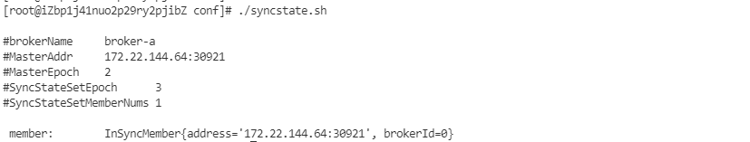

# Master-Slave automatic switch Quick start 

## Introduction



This document mainly introduces how to quickly build a RocketMQ cluster that supports automatic master-slave switch, as shown in the above diagram. The main addition is the Controller component, which can be deployed independently or embedded in the NameServer.

For detailed design ideas, please refer to [Design ideas](design.md).

For detailed guidelines on new cluster deployment and old cluster upgrades, please refer to [Deployment guide](deploy.md).

## Compile RocketMQ source code

```shell
$ git clone https://github.com/apache/rocketmq.git

$ cd rocketmq

$ mvn -Prelease-all -DskipTests clean install -U
```

## Quick deployment

After successful build

```shell
#{rocketmq-version} replace with rocketmq actual version. example: 5.0.0-SNAPSHOT
$ cd distribution/target/rocketmq-{rocketmq-version}/rocketmq-{rocketmq-version}/

$ sh bin/controller/fast-try.sh start
```

If the above steps are successful, you can view the status of the Controller using the operation and maintenance command.

```shell
$ sh bin/mqadmin getControllerMetaData -a localhost:9878
```

`-a` represents the address of any controller in the cluster

At this point, you can send and receive messages in the cluster and perform switch testing.

If you need to shut down the cluster quickly , you can execute：

```shell
$ sh bin/controller/fast-try.sh stop
```

For quick deployment, the default configuration is in `conf/controller/quick-start`, the default storage path is `/tmp/rmqstore`, and a controller (embedded in Namesrv) and two brokers will be started.

### Query SyncStateSet

 Use the operation and maintenance tool to query SyncStateSet：

```shell
$ sh bin/mqadmin getSyncStateSet -a localhost:9878 -b broker-a
```

`-a` represents the address of any controller

If successful, you should see the following content：



### Query BrokerEpoch

 Use the operation and maintenance tool to query  BrokerEpochEntry：

```shell
$ sh bin/mqadmin getBrokerEpoch -n localhost:9876 -b broker-a
```

`-n` represents the address of any Namesrv

If successful, you should see the following content：



## Switch

After successful deployment, try to perform a master switch now.

First, kill the process of the original master, in the example above, it is the process using port 30911：

```shell
#query port:
$ ps -ef|grep java|grep BrokerStartup|grep ./conf/controller/quick-start/broker-n0.conf|grep -v grep|awk '{print $2}'
#kill master:
$ kill -9 PID
```

Next,use `SyncStateSet admin` script to query：

```shell
$ sh bin/mqadmin getSyncStateSet -a localhost:9878 -b broker-a
```

The master has switched.




## Deploying controller embedded in Nameserver cluster

The Controller component is embedded in the Nameserver cluster (consisting of 3 nodes) and quickly started through the plugin mode：

```shell
$ sh bin/controller/fast-try-namesrv-plugin.sh start
```

Alternatively, it can be started separately through a command：

```shell
$ nohup bin/mqnamesrv -c ./conf/controller/cluster-3n-namesrv-plugin/namesrv-n0.conf &
$ nohup bin/mqnamesrv -c ./conf/controller/cluster-3n-namesrv-plugin/namesrv-n1.conf &
$ nohup bin/mqnamesrv -c ./conf/controller/cluster-3n-namesrv-plugin/namesrv-n2.conf &
```

If the above steps are successful, you can check the status of the Controller cluster through operational commands:

```shell
$ sh bin/mqadmin getControllerMetaData -a localhost:9878
```

`-a` represents the address of any Controller nodes

If the Controller starts successfully, you can see the following content:

```
#ControllerGroup        group1
#ControllerLeaderId     n0
#ControllerLeaderAddress        127.0.0.1:9878
#Peer:  n0:127.0.0.1:9878
#Peer:  n1:127.0.0.1:9868
#Peer:  n2:127.0.0.1:9858
```

After the successful start, the broker controller mode deployment can use the controller cluster.

If you need to quickly stop the cluster：

```shell
$ sh bin/controller/fast-try-namesrv-plugin.sh stop
```

The `fast-try-namesrv-plugin.sh` script is used for quick deployment with default configurations in the `conf/controller/cluster-3n-namesrv-plugin` directory, and it will start 3 Nameservers and 3 controllers (embedded in Nameserver).

## Deploying Controller in independent cluster

The Controller component is deployed in an independent cluster (consisting of 3 nodes) and quickly started.：

```shell
$ sh bin/controller/fast-try-independent-deployment.sh start
```

Alternatively, it can be started separately through a command：

```shell
$ nohup bin/mqcontroller -c ./conf/controller/cluster-3n-independent/controller-n0.conf &
$ nohup bin/mqcontroller -c ./conf/controller/cluster-3n-independent/controller-n1.conf &
$ nohup bin/mqcontroller -c ./conf/controller/cluster-3n-independent/controller-n2.conf &
```

If the previous steps are successful, you can check the status of the Controller cluster using the operational command.

```shell
$ sh bin/mqadmin getControllerMetaData -a localhost:9878
```

`-a` represents the address of any controller.

If the controller starts successfully, you will see the following content:

```
#ControllerGroup        group1
#ControllerLeaderId     n1
#ControllerLeaderAddress        127.0.0.1:9868
#Peer:  n0:127.0.0.1:9878
#Peer:  n1:127.0.0.1:9868
#Peer:  n2:127.0.0.1:9858
```

After starting successfully, the broker controller mode deployment can use the controller cluster.

If you need to quickly stop the cluster：

```shell
$ sh bin/controller/fast-try-independent-deployment.sh stop
```

Use the `fast-try-independent-deployment.sh` script to quickly deploy, the default configuration is in `conf/controller/cluster-3n-independent` and it will start 3 controllers (independent deployment) to form a cluster.


## Note

- If you want to ensure that the Controller has fault tolerance, the Controller deployment requires at least three copies (in accordance with the majority protocol of Raft).
- In the controller deployment configuration file, the IP addresses configured in the `controllerDLegerPeers` parameter should be configured as IPs that can be accessed by other nodes. This is especially important when deploying on multiple machines. The example is for reference only and needs to be modified and adjusted according to the actual situation.
