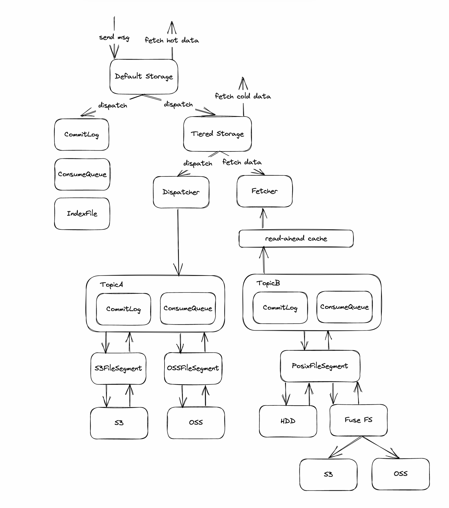

# Tiered storage for RocketMQ (Technical preview)

RocketMQ tiered storage allows users to offload message data from the local disk to other cheaper and larger storage mediums. So that users can extend the message reserve time at a lower cost. And different topics can flexibly specify different TTL as needed.

This article is a cookbook for RocketMQ tiered storage.

## Architecture

## Quick start

Use the following steps to easily use tiered storage

1. Change `messageStorePlugIn` to `org.apache.rocketmq.tieredstore.MessageStoreExtend` in your `broker.conf`.
2. Configure your backend service provider. change `tieredBackendServiceProvider` to your storage medium implement. We give a default implement: POSIX provider, and you need to change `tieredStoreFilePath` to the mount point of storage medium for tiered storage.
3. Start the broker and enjoy!

## Configuration

The following are some core configurations, for more details, see [TieredMessageStoreConfig](https://github.com/apache/rocketmq/blob/develop/tieredstore/src/main/java/org/apache/rocketmq/tieredstore/common/TieredMessageStoreConfig.java)

| Configuration                   | Default value                                                 | Unit        | Function                                                                        |
| ------------------------------- |---------------------------------------------------------------| ----------- | ------------------------------------------------------------------------------- |
| messageStorePlugIn              |                                                               |             | Set to org.apache.rocketmq.tieredstore.MessageStoreExtend to use tiered storage |
| tieredMetadataServiceProvider   | org.apache.rocketmq.tieredstore.metadata.DefaultMetadataStore |             | Select your metadata provider                                                   |
| tieredBackendServiceProvider    | org.apache.rocketmq.tieredstore.provider.PosixFileSegment     |             | Select your backend service provider                                            |
| tieredStoreFilePath             |                                                               |             | Select the directory using for tiered storage, only for POSIX provider.         |
| tieredStorageLevel              | NOT_IN_DISK                                                   |             | The options are DISABLE, NOT_IN_DISK, NOT_IN_MEM, FORCE                         |
| tieredStoreFileReservedTime     | 72                                                            | hour        | Default topic TTL in tiered storage                                             |
| tieredStoreGroupCommitCount     | 2500                                                          |             | The number of messages that trigger one batch transfer                          |
| tieredStoreGroupCommitSize      | 33554432                                                      | byte        | The size of messages that trigger one batch transfer, 32M by default            |
| tieredStoreMaxGroupCommitCount  | 10000                                                         |             | The maximum number of messages waiting to be transfered per queue               |
| readAheadCacheExpireDuration    | 1000                                                          | millisecond | Read-ahead cache expiration time                                                |
| readAheadCacheSizeThresholdRate | 0.3                                                           |             | The maximum heap space occupied by the read-ahead cache                         |

## Metrics

Tiered storage provides some useful metrics, see [RIP-46](https://github.com/apache/rocketmq/wiki/RIP-46-Observability-improvement-for-RocketMQ) for details.

| Type      | Name                                                | Unit         |
| --------- | --------------------------------------------------- | ------------ |
| Histogram | rocketmq_tiered_store_api_latency                   | milliseconds |
| Histogram | rocketmq_tiered_store_provider_rpc_latency          | milliseconds |
| Histogram | rocketmq_tiered_store_provider_upload_bytes         | byte         |
| Histogram | rocketmq_tiered_store_provider_download_bytes       | byte         |
| Gauge     | rocketmq_tiered_store_dispatch_behind               |              |
| Gauge     | rocketmq_tiered_store_dispatch_latency              | byte         |
| Counter   | rocketmq_tiered_store_messages_dispatch_total       |              |
| Counter   | rocketmq_tiered_store_messages_out_total            |              |
| Counter   | rocketmq_tiered_store_get_message_fallback_total    |              |
| Gauge     | rocketmq_tiered_store_read_ahead_cache_count        |              |
| Gauge     | rocketmq_tiered_store_read_ahead_cache_bytes        | byte         |
| Counter   | rocketmq_tiered_store_read_ahead_cache_access_total |              |
| Counter   | rocketmq_tiered_store_read_ahead_cache_hit_total    |              |
| Gauge     | rocketmq_storage_message_reserve_time               | milliseconds |

## How to contribute

We need community participation to add more backend service providers for tiered storage. [PosixFileSegment](https://github.com/apache/rocketmq/blob/develop/tieredstore/src/main/java/org/apache/rocketmq/tieredstore/provider/posix/PosixFileSegment.java), the implementation provided by default is just an example. People who want to contribute can follow it to implement their own providers, such as S3FileSegment, OSSFileSegment, and MinIOFileSegment. Here are some guidelines:

1. Extend [TieredFileSegment](https://github.com/apache/rocketmq/blob/develop/tieredstore/src/main/java/org/apache/rocketmq/tieredstore/provider/TieredFileSegment.java) and implement the methods of [TieredStoreProvider](https://github.com/apache/rocketmq/blob/develop/tieredstore/src/main/java/org/apache/rocketmq/tieredstore/provider/TieredStoreProvider.java) interface.
2. Record metrics where appropriate. See `rocketmq_tiered_store_provider_rpc_latency`, `rocketmq_tiered_store_provider_upload_bytes`, and `rocketmq_tiered_store_provider_download_bytes`
3. No need to maintain your own cache and avoid polluting the page cache. It is already having the read-ahead cache.
